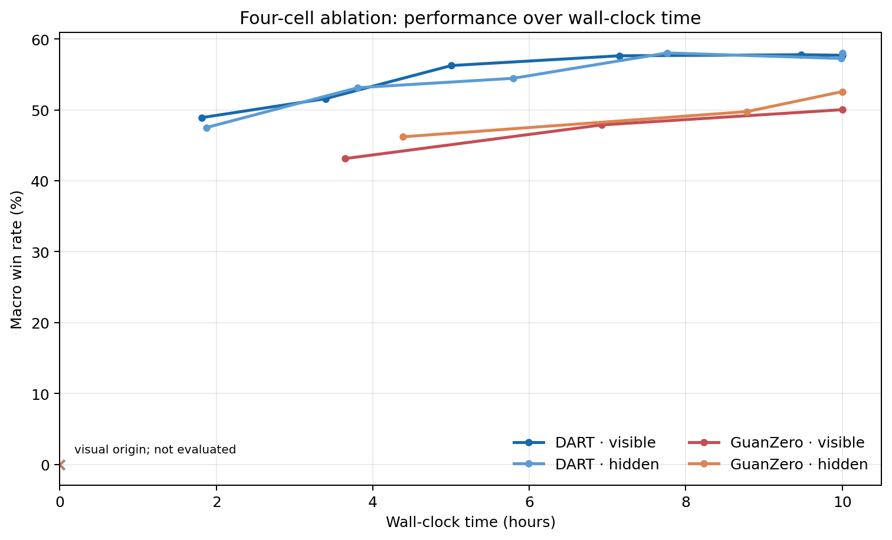
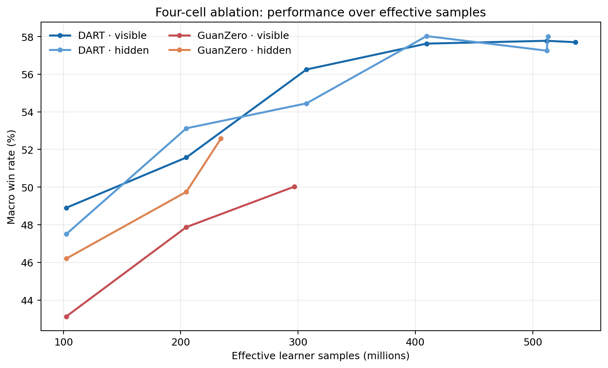
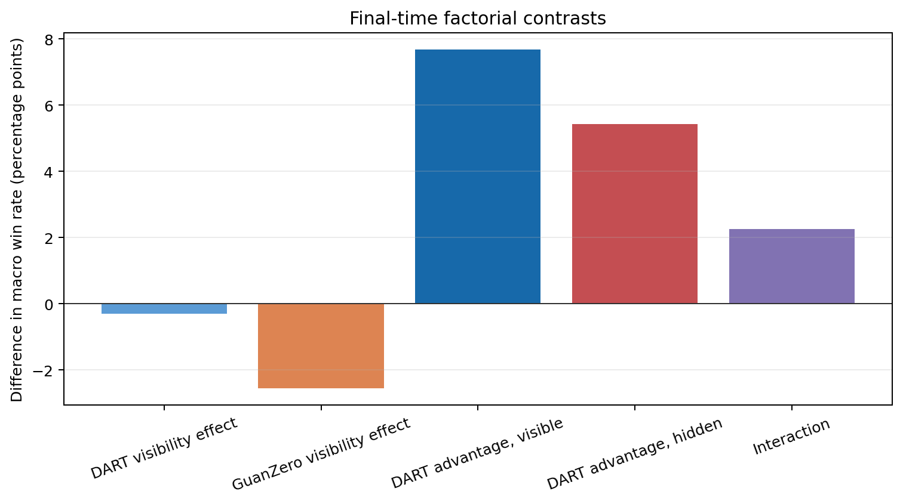

# DART — Dynamic Action-Relative Routing for Tricks

[](https://github.com/winstonxcai/chucking-eggs/actions/workflows/ci.yml)

[](LICENSE)

DART is a distributed Deep Monte Carlo reinforcement-learning agent for
cooperative **Guan Dan (掼蛋)**. Guan Dan is a four-player, two-team game with a
108-card double deck, changing wild cards, large legal-action sets, and sparse
team-level outcomes. DART studies whether routing decisions by relative trick
role can provide a compact representation for cooperative play.

This repository is a research artifact first. It contains the training system,
evaluation protocol, controlled ablations, release evidence, and a playable
web application as a secondary demonstration surface.

## Research at a glance

The central architectural hypothesis is simple: leading, responding across
from a partner, and closing a trick are different tactical roles even when the
absolute seat changes. DART therefore uses one shared Q-network trunk with four
small trick-position heads. A deterministic router selects the head for the
acting player's current role.

The primary study compares canonical DART and GuanZero under matched Modal L4
hardware, a ten-hour wall-clock budget, 4,096 effective learner samples per
update, seed, replay policy, and evaluation protocol. The study is not
parameter-matched: DART shares its network while GuanZero uses one network per
seat.

## Headline evidence

The larger 1.25M-update DART release reaches **69.32%** on the 10,000-game
hard-4 evaluation and **69.49%** on the 5,000-game release evaluation against
Yaoji, EZ, Jidan, and Strategic. The complete release evidence is under
[`ml/results/release_1_25m`](ml/results/release_1_25m).

The controlled ten-hour ablation is the primary algorithm comparison:

| Checkpoint | Yaoji | EZ | Jidan | Strategic | Macro average |
|---|---:|---:|---:|---:|---:|
| DART, 1.25M updates | 62.65% | 66.25% | 71.43% | 76.95% | **69.32%** |
| DART, 1.35M updates | 62.74% | 66.16% | 71.45% | 76.69% | 69.26% |

See the [research note](docs/RESEARCH.md) for the scientific framing and
[reproducibility guide](docs/REPRODUCIBILITY.md) for the exact artifact path.

## Ablations

### Design

The controlled study is a 2×2 factorial design:

| Algorithm | Partner visibility |
|---|---|
| DART | visible / hidden |
| GuanZero | visible / hidden |

The question is which canonical formulation performs better under equal
hardware, time, and effective learner samples. Partner visibility is a separate
information-setting axis, not a claim about deployment under strict
hidden-information play.

### Results

Each final checkpoint was evaluated against Yaoji, EZ, Jidan, and Strategic
with 1,000 paired fixed-deck games per opponent. Macro win rate is the
unweighted mean of those four rates. Values are generated from the curated
[ablation artifact](ml/results/ablation_l4_10h/summary.json).

| Algorithm | Partner | Parameters | Macro WR | Yaoji | EZ | Jidan | Strategic | Effective samples | Updates |
|---|---|---:|---:|---:|---:|---:|---:|---:|---:|
| DART | visible | 4.7M | **57.7%** | 49.7% | 51.0% | 59.0% | 71.1% | 536.5M | 130,970 |
| DART | hidden | 4.7M | **58.0%** | 51.9% | 51.9% | 58.2% | 70.0% | 513.0M | 125,250 |
| GuanZero | visible | 28.4M | **50.0%** | 37.5% | 46.1% | 48.2% | 68.3% | 296.9M | 72,480 |
| GuanZero | hidden | 28.4M | **52.6%** | 44.0% | 49.2% | 50.1% | 67.0% | 234.2M | 57,180 |

DART's approximately 4.7M parameters are shared across roles. GuanZero has
four independent approximately 7.1M seat networks, approximately 28.4M total.
This is an intentional algorithmic asymmetry, so the result is an equal-
hardware, equal-time, equal-effective-sample comparison—not a parameter-
matched comparison.



The zero-hour marker is a visual origin, not an evaluated checkpoint.





At the ten-hour endpoint, DART leads GuanZero by 7.67 percentage points with
partner visibility and 5.43 points without it. Partner visibility itself does
not improve the endpoint score in this single-seed study: the visible-minus-
hidden effect is −0.30 points for DART and −2.55 points for GuanZero. These are
finite-budget observations, not claims about converged training.

The historical two-week GuanZero run is useful context but is not a controlled
comparison to this ten-hour experiment. See the [research note](docs/RESEARCH.md)
for limitations and follow-up experiments.

## Method

DART follows the Deep Monte Carlo lineage of DouZero and GuanZero. CPU actors
generate complete games, a learner trains Q-values from terminal team rewards,
and legal actions are scored directly. The encoder is role-normalized and can
expose the partner hand as an explicit research assumption. A derived
`others_hand` channel represents the collective opposing hand by deck
subtraction; it does not reveal per-opponent ownership.

The runtime is a persistent actor–learner system with bounded queues,
filesystem-based weight publication, replay throttling, checkpoint evaluation,
and full-checkpoint resume. See [Architecture](docs/ARCHITECTURE.md) for the
process and state-flow details.

## Reproduction

Start with the [Reproducibility guide](docs/REPRODUCIBILITY.md). It covers the
locked environment, CPU smoke, four ablation configurations, Modal launch
pattern, effective learner-sample semantics, artifact manifest, evaluation
protocol, and limitations of exact CUDA determinism.

The four-cell configurations are:

- [shared L4 baseline](ml/src/guandan/dart/configs/ablation_l4_common.yaml);
- [DART visible](ml/src/guandan/dart/configs/ablation_l4_dart_partner_visible_10h.yaml);
- [DART hidden](ml/src/guandan/dart/configs/ablation_l4_dart_partner_hidden_10h.yaml);
- [GuanZero visible](ml/src/guandan/dart/configs/ablation_l4_guanzero_partner_visible_10h.yaml);
- [GuanZero hidden](ml/src/guandan/dart/configs/ablation_l4_guanzero_partner_hidden_10h.yaml).

## Quick start

```bash
git clone https://github.com/winstonxcai/chucking-eggs
cd chucking-eggs
uv sync --group dev
uv run pytest -q ml/tests
```

Run the full CPU actor–learner smoke:

```bash
uv run python -m guandan.dart \
  --config ml/src/guandan/dart/configs/dart_cpu_smoke.yaml \
  --updates 5 --run-dir ml/runs/cpu_smoke
```

The native Rust move generator is optional for correctness and local play:

```bash
uv run maturin develop --release --manifest-path ml/src/guandan_rs/Cargo.toml
```

Evaluate the released checkpoint against one opponent:

```bash
uv run guandan-eval-dart \
  --checkpoint ml/results/release_1_25m/update_01250000.pt \
  --opponent strategic --games 5000 --out results.json
```

## Application demo

The web app is a secondary demonstration of the shared game engine. The live
application supports solo, duo, and quad play with Elo ratings and a reviewable
game history. It is deployed at
[chucking-eggs.vercel.app](https://chucking-eggs.vercel.app), while the hosted
service intentionally does not load DART for cost reasons.

Run the application locally with Docker Compose or consult the
[Web API reference](docs/API.md). The application is not required for training,
evaluation, or research reproducibility.

## Documentation

- [Research note](docs/RESEARCH.md): problem, method, study design, findings,
  limitations, and open questions.
- [Reproducibility](docs/REPRODUCIBILITY.md): environments, configs, artifacts,
  and reproduction protocol.
- [Architecture](docs/ARCHITECTURE.md): process model, data flow, replay, and
  runtime invariants.
- [Evaluation](docs/EVALUATION.md): paired-deck evaluation and confidence
  intervals.
- [Model card](docs/MODEL_CARD.md): intended use and release limitations.
- [Development](docs/DEVELOPMENT.md): tests, profiling, and contribution
  workflow.

## Limitations

The released model and the ablation study use a single training seed and
rule-based evaluation opponents. The controlled study is not parameter
matched, does not establish convergence, and includes evaluation overhead in
its wall-clock lifecycle. Partner-visible observation is a research setting,
not strict hidden-information deployment. The native Rust and pure-Python
move generators are both maintained, but the primary large-run throughput path
uses the native extension.

## Citation and attribution

```bibtex
@software{cai2026dart,
  author = {Cai, Winston},
  title = {DART: Dynamic Action-Relative Routing for Tricks},
  year = {2026},
  url = {https://github.com/winstonxcai/chucking-eggs}
}
```

The original project code is MIT licensed. Competition bots are separately
attributed in [NOTICE](NOTICE) and may have distinct licensing status.
