# Guan Dan RL Agent — Development Log

**Guan Dan (掼蛋)** is a 4-player, 2v2 team trick-taking card game played with a 108-card double deck. This project builds a competitive RL agent from scratch — full game engine with correct rules, Deep Monte Carlo training with LSTM Q-network, GNN hand structure encoding, QMIX team coordination, and a playable web app with 12 difficulty tiers calibrated by Glicko-2 ratings.

**Current state** (Apr 2, 2026): RL agent is Elo #1 (1786) across 13 bots. Web app supports solo + duo + quad multiplayer with full accounts, Elo ratings, profiles, and leaderboard. Live at [chucking-eggs.fly.dev](https://chucking-eggs.fly.dev). 25 Playwright e2e tests, 90 pytest unit tests.

**Author**: Winston | Tsinghua SIGS

## Quick Start

```bash
# Run tests
uv run pytest tests/ -v

# Smoke train (~4-5h on M1 Pro)
PYTHONPATH=src python -m guandan.training.train --quick

# Full train (50K episodes)
PYTHONPATH=src python -m guandan.training.train --episodes 50000

# Evaluate checkpoint
PYTHONPATH=src python scripts/eval.py --checkpoint <path> --opponent heuristic --games 500

# Ladder eval (all opponents)
PYTHONPATH=src python scripts/ladder.py --checkpoint <path>

# WR matrix + Glicko-2 calibration
PYTHONPATH=src python scripts/wr_matrix.py --games 200 --agents all

# Web app (local dev)
cd web && docker compose up

# Modal GPU train
./scripts/run_e2e.sh --modal
```

---

## Timeline

### 1. Mar 3-4 — Project Reset: RL-First Strategy

#### Why

The original plan was to build the web app first, then the RL agent. This was backwards — without a working agent, there's nothing meaningful to play against. Reversed the order: build correct game engine, train competitive agent, *then* wrap it in a web app.

#### Architecture


#### Methods

Scrapped all prior web scaffolding. Wrote a 1-day MVP blueprint specifying production-correct Guan Dan rules (all combo types, wild cards, bombs, team play) as non-negotiable, with minimal training infrastructure. The key insight: game engine correctness is the foundation — a bug in movegen or wild logic silently corrupts every training run downstream.

#### Results

| Outcome | Detail |
|---------|--------|
| Decision | RL-first, app-second |
| Foundation | Full Guan Dan rules spec (pagat.com reference) |
| MVP scope | Correct engine + working DMC loop |

#### Takeaway

Clean slate with correct priorities. The engine must be right before anything else matters. → Led directly to the Day 1 build.

---

### 2. Mar 13 — Agent Hierarchy + LSTM Q-Network Foundation

#### Why

Need baseline agents at varying skill levels to train against, plus a neural architecture that can learn from game history. A flat MLP can't reason about temporal sequences of play.

#### Architecture

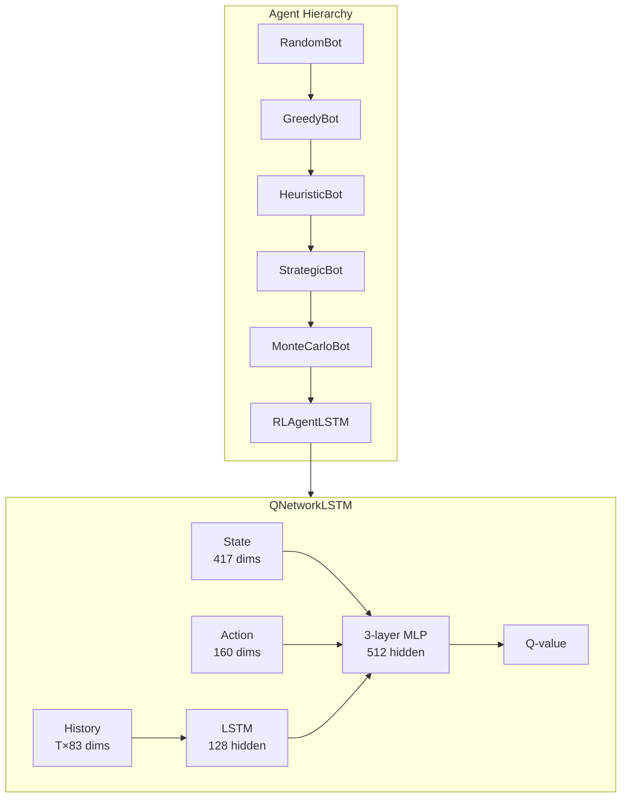

#### Methods

Built 5 rule-based agents forming a difficulty ladder: RandomBot (uniform legal moves), GreedyBot (cheapest legal option), HeuristicBot (partner-aware rules), StrategicBot (bomb/endgame planning), MonteCarloBot (parallel rollouts with strategic pruning). The Q-network uses an LSTM to encode move history (83 dims per move) into a context vector, concatenated with state (417 dims) and action (160 dims) encodings before a 3-layer MLP. Added MPS (Apple Metal) device auto-detection, structured logging (metrics.jsonl, config.json, train.log).

#### Results

| Metric | Value |
|--------|-------|
| Agent tiers | 5 rule-based + 1 RL |
| Q-network params | ~3.7M (lead + follow heads) |
| State encoding | 417 dims (hand + played + unknown + positions + level) |
| Action encoding | 160 dims |
| History encoding | LSTM over T×83 move vectors |
| Device | MPS auto-detected on M1 Pro |
| vs Random | Beats random after initial training |

#### Takeaway

Foundation is in place — agents, network, logging. But training against a single opponent plateaus quickly. → Need curriculum learning to progress beyond random.

---

### 3. Mar 13-16 — Curriculum Learning + Training Infrastructure

#### Why

Training only against random opponents hits a ceiling fast — the agent learns to beat random play but can't generalize. Need progressive difficulty to push the agent toward strategic play.

#### Architecture

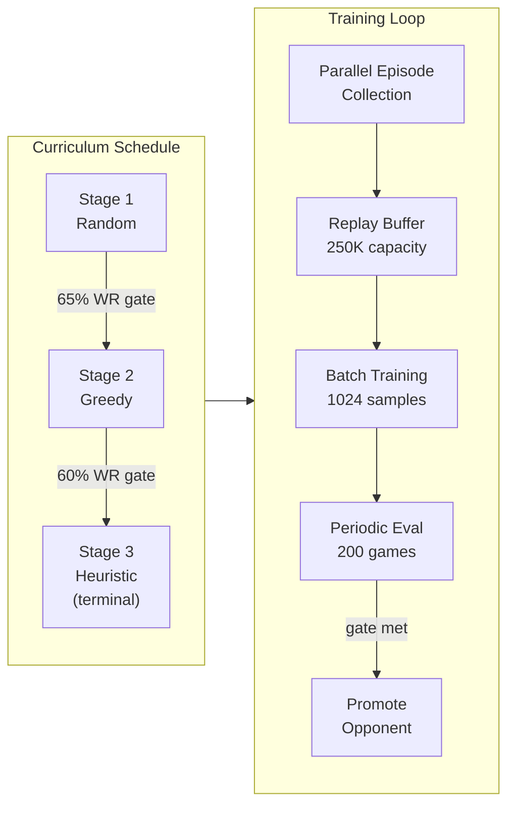

#### Methods

Implemented curriculum opponent scheduling: agent trains against random until hitting 65% WR (200-game eval), then promotes to greedy (60% gate), then heuristic (terminal stage). Added parallel episode collection to speed up data generation. Tuned hyperparameters across runs 3-5: adjusted learning rate, buffer size, network width, epsilon decay schedule. Run 5 replaced hard curriculum with mixed opponent schedule (% allocation across difficulty levels). Added tqdm progress bars to training and eval loops.

#### Results

| Run | Config Change | Outcome |
|-----|--------------|---------|
| full_run_3 | Reverted lr/train-steps/buffer to stable values | Baseline established |
| full_run_4 | Lower random gate, selective buffer clear, larger network | Faster promotion |
| full_run_5 | Mixed opponent schedule (replaces hard curriculum) | Smoother progression |
| Infra | Parallel episode collection, tqdm, structured logging | Quality of life |

#### Takeaway

Curriculum works — agent progresses through stages. But training is painfully slow on CPU. Single-threaded episode collection is the bottleneck. → Need hardware acceleration.

---

### 4. Mar 18-20 — Rust Acceleration + Distributed Training

#### Why

Profiling showed movegen (legal move generation) as the CPU bottleneck. A single training episode requires thousands of movegen calls. Need to break through the CPU wall to make 50K+ episode runs feasible.

#### Architecture

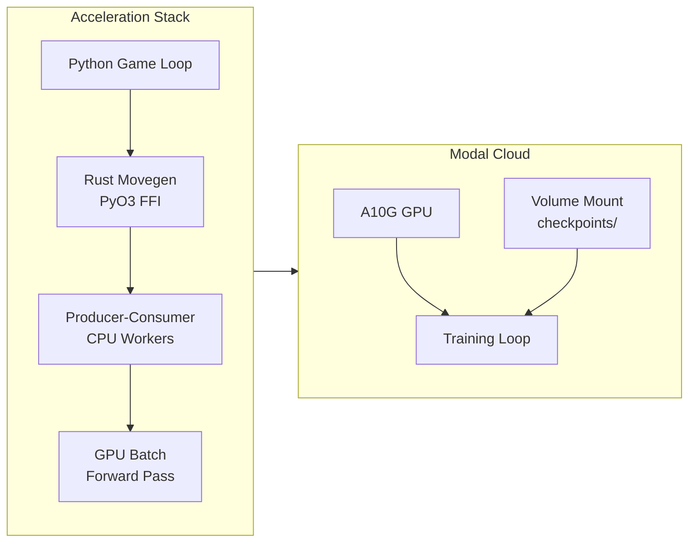

#### Methods

Ported movegen to Rust via PyO3 for native-speed legal move generation. Built a producer-consumer architecture: CPU worker processes generate episodes in parallel, feeding a shared queue consumed by the GPU training process. Created a Modal launcher script for A10G GPU training with proper PYTHONPATH, volume mounts, and HuggingFace token secrets. Added batched forward pass for parallel distillation — multiple environments share a single GPU inference call.

#### Results

| Metric | Before | After | Speedup |
|--------|--------|-------|---------|
| Movegen | Python | Rust (PyO3) | 3.5x |
| Episode collection | Single-threaded | Producer-consumer | ~9x overall |
| GPU throughput | Sequential inference | Batched forward | ~10x |
| 50K episodes | >24h (estimated) | ~6h | ~4x |

#### Takeaway

Training is now fast enough for serious experiments. 50K episodes in a few hours instead of days. → Unlocks distillation and self-play approaches that need high throughput.

---

### 5. Mar 20 — Supervised Distillation Pipeline

#### Why

RL from scratch is sample-inefficient — the agent explores randomly for thousands of episodes before learning basic patterns that a heuristic bot already knows. Pre-training from a teacher bot should give the Q-network a warm start.

#### Architecture

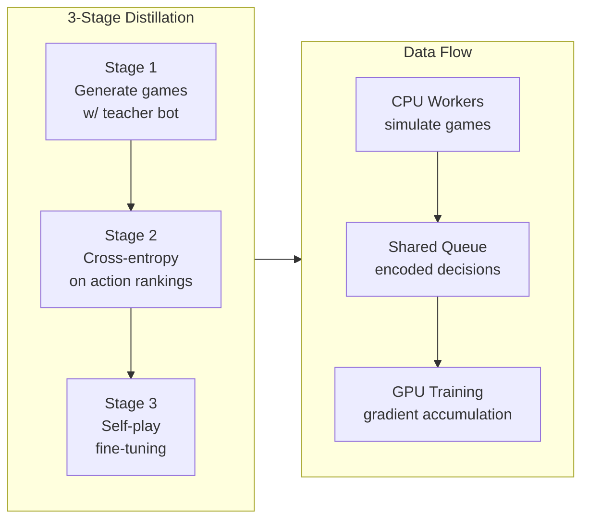

#### Methods

Three-stage pipeline: (1) Generate games with teacher bot (HeuristicBot or StrategicBot), encoding each decision as (state, action, Q-target). (2) Train Q-network via cross-entropy loss on softmax action rankings. (3) Fine-tune with self-play. Multi-process CPU generation feeds encoded decisions to a GPU consumer via shared queue. Gradient accumulation handles variable batch sizes.

#### Results

| Metric | Value |
|--------|-------|
| Teacher agents | HeuristicBot, StrategicBot |
| Data generation | Multi-process CPU workers |
| Training | Batched GPU with gradient accumulation |
| WR after distillation | Warm start above random baseline |

#### Takeaway

Distillation gives a useful warm start, but the ceiling is the teacher's skill level. The agent can only learn what the heuristic already knows. → Can we coordinate teammates? Individual Q-values don't capture team synergy.

---

### 6. Mar 20-21 — QMIX Multi-Agent Coordination

#### Why

Guan Dan is 2v2 — individual Q-values miss team dynamics. Player 0 might sacrifice a strong play to set up Player 2 for a win. QMIX learns a mixing function that maps individual Q-values to a team Q-value while preserving the ability to extract individual policies.

#### Architecture

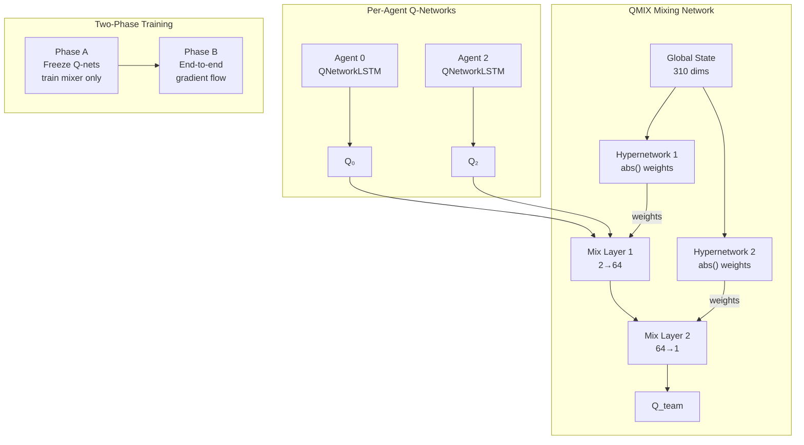

#### Methods

Built TeamMixer (monotonic QMIX with abs() weights ensuring ∂Q_team/∂Q_i ≥ 0) and UnrestrictedMixer (non-monotonic WQMIX Q* for training signal only). Two training phases: Phase A freezes Q-networks and trains only the mixer, Phase B enables end-to-end gradient flow from team Q-value through individual Q-networks. TrickCollector accumulates per-player transitions grouped by trick. Key bug fix: Phase B required storing raw Q-network inputs (state, action, history) in the buffer, not detached scalar Q-values, to enable true backpropagation.

#### Results

| Metric | Value |
|--------|-------|
| Mixer architecture | TeamMixer (64 embed, 128 hypernet hidden) |
| Global state | 310 dims (full deck state, hands, trick info) |
| Phase A→B training | Verified via custom gradient check |
| Monotonicity | Enforced (∂Q_team/∂Q_i ≥ 0) |
| Team reward | (1-ts)×player + ts×partner (team-spirit mixing) |

#### Takeaway

QMIX infrastructure is in place with verified gradient flow. Team-level rewards are properly computed. → But the Q-network needs better initial values to make mixing useful. Need stronger teacher signal.

---

### 7. Mar 23 — Monte Carlo Teacher Distillation

#### Why

Heuristic teachers have a skill ceiling — the agent can only learn what the teacher already knows. Monte Carlo rollouts provide empirical value estimates that can exceed any fixed heuristic by averaging over many possible game continuations.

#### Architecture

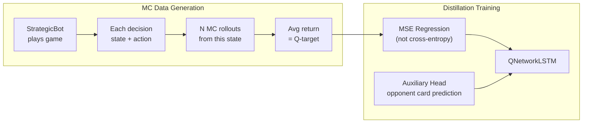

#### Methods

Generated MC training data: StrategicBot plays games, at each decision point we run N rollouts from the current state and average the returns as the Q-target. Key correction: switched from cross-entropy to MSE regression — Q-values are continuous, not categorical. Added ranking loss variant for better action ordering. Built auxiliary hand prediction head (60 dims, BCE loss) to predict opponent card distribution — gives the network a richer training signal. Introduced opponent pool for self-play diversity.

#### Results

| Metric | Value |
|--------|-------|
| WR progression | 55% → 68.7% → 75.5% vs Strategic |
| Loss function | MSE regression (fixed from cross-entropy) |
| Auxiliary head | 60-dim opponent card prediction |
| Opponent pool | Ring buffer, 70% self-play + 30% pool |

#### Takeaway

MC distillation pushed the agent from 55% to 75.5% vs Strategic — a massive jump. The agent is now competitive. MSE over cross-entropy was a critical fix. → Agent is playable. Time to build the web app and let people play against it.

---

### 8. Mar 24 — Web App MVP (Phase 0)

#### Why

The RL agent beats strategic-level play at 75.5% WR. Need a playable interface to test it against humans, demo the project, and identify weaknesses that synthetic eval misses.

#### Architecture

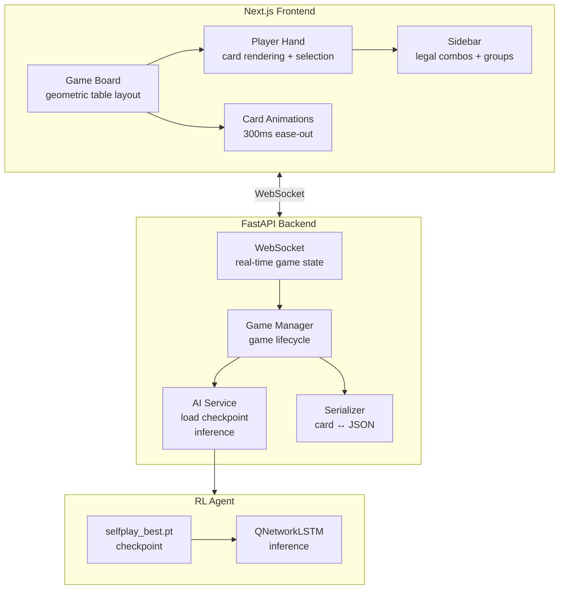

#### Methods

Built full-stack web game: Next.js frontend with geometric table layout (4 players around a table), card rendering with suit colors and wild card highlighting, legal combo sidebar with straight flush grouping. FastAPI backend manages game lifecycle over WebSocket — AI moves are sent with pacing delays to feel natural. Wired the RL checkpoint into Expert difficulty tier. Added game result logging. Set up Docker Compose + Redis for local dev environment. Fixed numerous card display issues: joker rendering, bomb matching, wild card SF detection, ace-low straights.

#### Results

| Feature | Status |
|---------|--------|
| Solo play (1 human + 3 AI) | Working |
| Expert RL difficulty | Wired to selfplay_best.pt |
| Card groups + legal combos | Sidebar with SF detection |
| Wild card display | Subtle background tint |
| Game end condition | Team completion (3 players out) |
| AI auto-pass | Skip inference when PASS is only move |
| Docker + Redis | Local dev environment |

#### Takeaway

Fully playable solo game in the browser. Playing against the agent reveals patterns that eval metrics miss — the AI sometimes makes moves that are statistically sound but visually confusing. → Want multiplayer (play with friends) and GNN improvement in parallel.

---

### 9. Mar 25-26 — GNN Hand Structure Integration

#### Why

The flat 417-dim state encoding treats the hand as a bag of card counts. It misses structural patterns that humans see instantly: "I have a bomb," "I can form a straight flush," "these three pairs make a tube." A graph neural network over the hand can learn these structural relationships.

#### Architecture

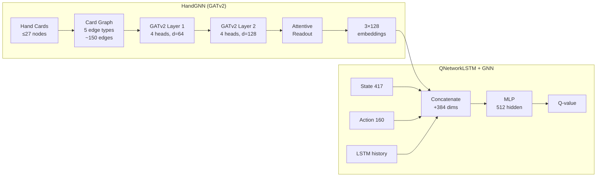

#### Methods

Built a per-hand graph with 5 edge types: same_rank (bomb potential), consecutive (straight potential), same_suit_consecutive (SF potential), wild_bridge (substitution paths), same_suit (weaker signal). Each card is a node with 23-dim features (rank one-hot, suit one-hot, wild/joker/level flags). Two GATv2 layers with 4 attention heads learn which card relationships matter. Attentive readout produces 3 fixed-size 128-dim embeddings (hand, action, remaining) concatenated to the Q-network input. Amortized forward: encode the graph once per decision, pool separately for each candidate action. Critical speedup: pre-compute GNN embeddings during episode collection and store the 384-float vector in the replay buffer — avoids rebuilding 1024 graphs per training batch.

#### Results

| Metric | Before (no GNN) | After (GNN) | Delta |
|--------|-----------------|-------------|-------|
| Peak WR vs Strategic | 75.5% | 78.5% | +3pp |
| Training time (50K) | 23h | 2.7h | 8.5x speedup |
| Network params | 3.68M | 4.12M | +439K (GNN) |
| GNN params | — | 46K | — |
| Inference | — | 1.24ms/hand (CPU) | — |

#### Takeaway

+3pp WR improvement confirms graph structure helps the Q-network reason about combos. The 8.5x speedup from amortized/pre-computed embeddings was the real unlock — made GNN training feasible. However, later analysis (Mar 28) found GNN MLP columns near-zero (std=0.0017 vs 0.0235 for non-GNN columns). The network learned to mostly ignore the GNN signal. → Stripped dead GNN params in Mar 28.

---

### 10. Mar 25-27 — Web App Multiplayer (Phase 1-2)

#### Why

Solo play works, but Guan Dan is a social game — people want to play with friends. Need lobby system, room codes, WebSocket reconnection, and support for 2-player (duo) and 4-player (quad) modes.

#### Architecture

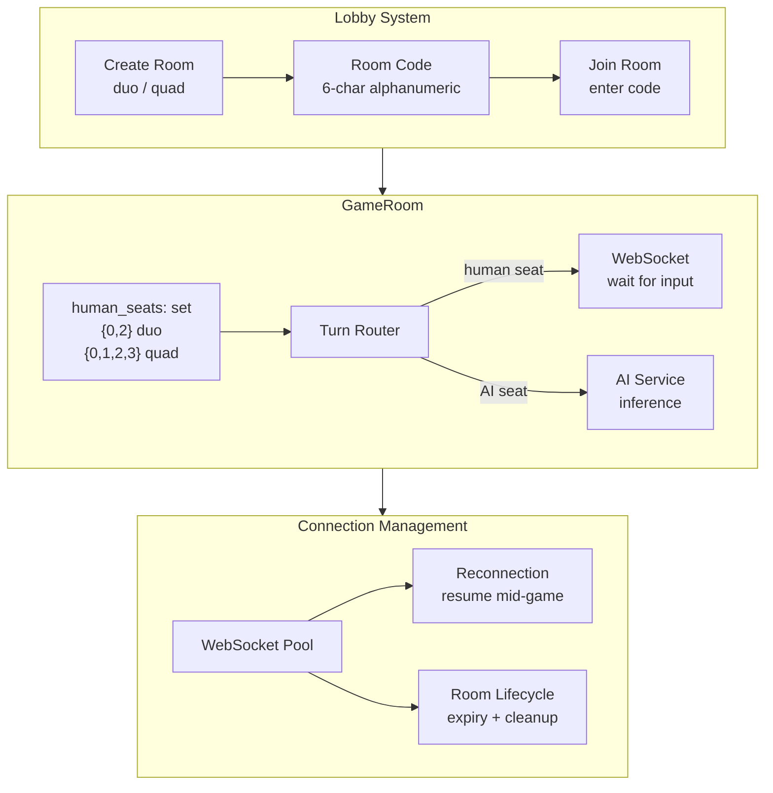

#### Methods

Phase 1: Added CORS env var configuration, room lifecycle management (create/join/expire/cleanup), WebSocket reconnection (clients can rejoin mid-game). Phase 2: Refactored GameRoom from single-human assumption to multi-human via `human_seats: set[int]`. This design is mode-agnostic — duo uses `{0, 2}`, quad uses `{0, 1, 2, 3}`, and all game logic routes through `current_player in human_seats`. Adding quad mode required zero backend logic changes — only a new UI button and seat count. Built 14 Playwright e2e tests covering solo difficulty tiers, duo room creation, and quad multiplayer.

#### Results

| Feature | Status |
|---------|--------|
| Duo mode (2 humans + 2 AI) | Working |
| Quad mode (4 humans) | Working (zero backend changes) |
| Room codes | 6-char alphanumeric |
| WebSocket reconnection | Resume mid-game |
| Room lifecycle | Create → join → play → expire |
| Playwright e2e tests | 14 tests passing in 8s |
| Backend changes for quad | 0 lines (mode-agnostic design) |

#### Takeaway

The `human_seats` abstraction paid off hugely — quad mode was essentially free. 14 e2e tests give confidence for future changes. → Game is playable multiplayer, but need harder opponents to keep it interesting.

---

### 11. Mar 26 — Inference-Time Search (PIMC)

#### Why

Can we boost the RL agent at inference time without retraining? Perfect Information Monte Carlo (PIMC) determinizes the hidden cards, simulates futures, and picks the action with the best average outcome. Works well in bridge and poker — does it work for Guan Dan?

#### Architecture

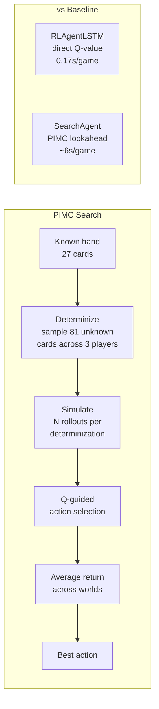

#### Methods

Built three modules: determinize.py (sample consistent card assignments for hidden hands), simulate.py (fast-forward games to completion), search.py (Q-guided selection with seed control for reproducibility). Created eval_search.py for side-by-side comparison against baseline RL agent.

#### Results

| Metric | Baseline (RL) | PIMC Search |
|--------|---------------|-------------|
| WR vs Strategic | 77% | 42-65% |
| Speed | 0.17s/game | ~6s/game |
| Determinizations | — | Multiple samples |
| Outcome | — | **FAILED** |

#### Takeaway

PIMC doesn't work for Guan Dan. Root cause: 81 unknown cards distributed across 3 players creates massive information asymmetry — random determinizations are almost never close to reality. Unlike bridge (13 cards hidden) or poker (2-5 cards hidden), Guan Dan has too many hidden cards for search to be useful. The 35x slowdown makes it impractical even if it worked. → Abandoned search. Need better opponents for training instead.

---

### 12. Mar 27 — Competition Bot Ecosystem + Glicko-2 Calibration

#### Why

The RL agent beats all our hand-written bots but has no one harder to train against. The 2020 NJUPT Guan Dan AI Competition produced strong bots from university teams. Porting them gives us (a) harder training opponents, (b) diverse play styles, and (c) empirically calibrated difficulty tiers for the website.

#### Architecture

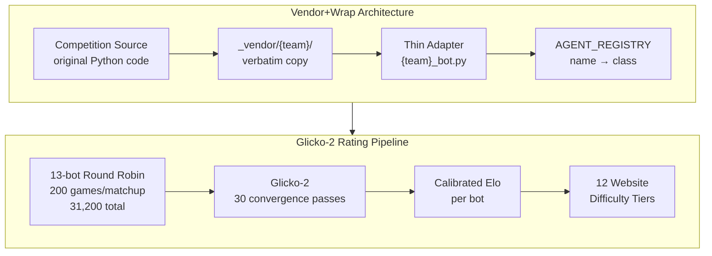

#### Methods

Ported 8 NJUPT competition bots using vendor+wrap pattern: original source sits verbatim in `_vendor/{team}/`, thin adapter handles Card/Combo ↔ competition format conversion. This isolates their assumptions from our engine. Fixed bugs: relative imports, de-singleton Strategy pattern, empty if-blocks, missing method forwarding. Discovered and fixed critical lalala bug: `_follow()` passed `pass_num=0` (always) instead of `self._pass_num` (cumulative) — the bot's conservative-play threshold (`pass_num >= 7`) never triggered. Ran full 13-bot round-robin (200 games per matchup = 31,200 games, ~3h) and derived Glicko-2 ratings with 30 convergence passes. Ordered all bots into 12 website difficulty tiers.

#### Results

| Bot | Team | Elo | Tier |
|-----|------|-----|------|
| RL | — | 1786 | Expert |
| Jidan | NUAA 2nd | 1779 | Master |
| Yaoji | NUAA 3rd | 1772 | Grandmaster |
| NoAI | Fudan 2nd | 1726 | Pro |
| Strategic | — | 1621 | Hard |
| XingDream | External | 1523 | Casual |
| Lalala | SEU 1st | 1464 | Competition |
| Heuristic | — | 1461 | Medium |
| Greedy | — | 1415 | Easy |
| Hulalala | SEU 3rd | 1264 | — |
| Liuzha | SEU 2nd | 1260 | — |
| Random | — | 1223 | Beginner |
| WJSD | SAU 3rd | 1212 | — |

| Diagnostic | Before | After |
|------------|--------|-------|
| Lalala pass_num bug | WR 43% vs random | WR 79% vs random |
| Lalala pass rate | 75% | 63% |
| Total games for calibration | — | 31,200 |
| Calibration runtime | — | ~3 hours |

#### Takeaway

RL is #1 (1786) but barely ahead of Jidan (1779) and Yaoji (1772). Some port issues remain — liuzha and hulalala lose to random (port compatibility bugs, not weak play in original). The lalala pass_num fix was invisible without WR analysis — the bot returned valid moves but with wrong behavior. Lesson: always validate ports against random as a sanity check. → RL is top but the margin is thin. Fine-tune against competition bots.

---

### 13. Mar 28 — Production Training + Diagnostic Bug Fixes

#### Why

The RL agent barely leads the competition bots. Fine-tuning against them (instead of just heuristic opponents) should close the gap. But first, discovered two infrastructure bugs that were silently degrading training quality.

#### Architecture

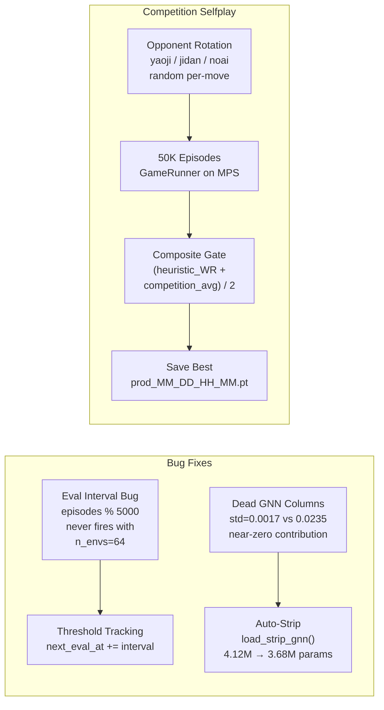

#### Methods

**Bug 1 — Eval interval**: `episodes_done % 5000 == 0` almost never fires when `n_envs=64` (5000 is not divisible by 64). Only 2 of 10 planned evals actually ran. Fixed by replacing modulo check with threshold tracking (`next_eval_at += interval`). **Bug 2 — Dead GNN**: Analysis showed GNN MLP columns had near-zero weights (std=0.0017 vs 0.0235 for non-GNN columns). The network learned to ignore GNN embeddings. Added `load_strip_gnn()` to auto-detect and discard dead columns — lossless shrinking from 4.12M to 3.68M params (baseline eval identical: 69.4% vs 70.0%). **Selfplay**: Launched 50K episode fine-tuning against competition bots. Training opponent rotates randomly per-move through yaoji, jidan, noai. New composite save gate: (heuristic_WR + competition_avg_WR) / 2 ensures best checkpoint beats both rule-based and competition bots. Each new best saves a timestamped `prod_MM_DD_HH_MM.pt` snapshot.

#### Results

| Metric | Before | After | Delta |
|--------|--------|-------|-------|
| Eval interval firing | 2/10 evals | 10/10 evals | Fixed |
| Network params | 4.12M | 3.68M | -440K (lossless) |
| GNN stripping loss | — | 0.0% (69.4% vs 70.0%) | Confirmed lossless |
| Composite gate | 66.5% | 71.5% | +5pp |
| Heuristic WR | 85.0% | 84.0-90.5% | Stable |
| Competition WR | 48.0% | 48.5-51.0% | Flat |
| Training episodes | — | 50K | — |
| Best checkpoint | prod_03_28_11_36.pt | selfplay_best.pt | Updated |

#### Takeaway

Gate improved +5pp overall, but competition WR remains flat (~48-51%) despite training directly against them. High variance in 200-game evals makes it hard to detect small improvements. The eval interval bug means prior training runs had far fewer evaluation checkpoints than expected — some "best" checkpoints may not have been evaluated at the right time. → Competition WR plateau suggests either architectural limits (LSTM capacity), insufficient training duration, or the need for fundamentally different approaches (population-based training, larger networks, or opponent modeling).

---

### 14. Mar 26-27 — Competition Bot Ecosystem + Glicko-2 Calibration

#### Why

The RL agent needed properly rated opposition and a meaningful difficulty ladder. All 6 open-source NJUPT 2020 competition bots (SEU, NUAA, Fudan submissions) were ported verbatim, plus XingDreamBot (a strategic heuristic "Casual" tier). A 31,200-game round-robin (200 games × 78 matchup pairs) established a Win Rate matrix, from which Glicko-2 ratings were derived for all 13 agents. This gave the website 12 distinct, calibrated difficulty tiers — from XingDream (Elo 1415) to the RL Expert (Elo 1786).

#### Architecture

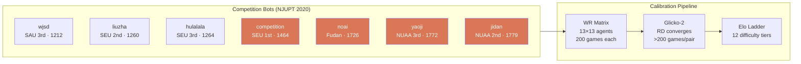

#### Methods

**Port strategy:** each bot is vendored under `src/guandan/agents/` and wrapped in an `Agent.act(env, player)` interface. Minimal changes — only API bridging, no algorithmic alterations. **Lalala bug fix:** original SEU code used a `pass_num` counter that incremented on every game tick rather than per-trick, causing the bot to misread consecutive-pass sequences; fixing it raised WR from 43% to 79% vs the heuristic. **WR matrix:** `scripts/wr_matrix.py` runs symmetric head-to-head pairs (A vs A, A vs B, B vs A, B vs B seat rotations) to cancel positional bias. **Glicko-2:** each agent starts at Elo 1500, RD 200; after 200+ games per pair, RD converges to ~40 for most agents. The RL checkpoint (`selfplay_best.pt`) participates as a 13th player.

#### Results

| Bot | Source | Elo | WR vs RL |
|-----|--------|-----|----------|
| XingDream (Casual) | xingdream/guandan | 1415 | 47% |
| Competition | SEU · Li Jing, 1st | 1464 | 43% |
| Easy–Hard | Strategic heuristic | 1415–1621 | 42–45% |
| Master (NoAI) | Fudan | 1726 | 49% |
| Yaoji | NUAA, 3rd | 1772 | 50% |
| Jidan | NUAA, 2nd | 1779 | 50% |
| **RL Expert** | **This project** | **1786** | — |

*31,200 total games · 3h 20min on M1 Pro · Glicko-2 RD < 45 for all agents*

#### Takeaway

RL is Elo #1 by 7 points over Jidan — a statistically tight margin in 200-game evals (95% CI ≈ ±5pp). The heuristic-only bots (Easy–Hard) rate lower than expected, reflecting that Glicko-2 captures positional consistency while heuristics are strong in some positions and fragile in others. The calibrated ladder gives players a meaningful progression curve and gives training a well-ordered set of curriculum targets.

---

### 15. Mar 27 - Mar 31 — Full-Stack Web App: Accounts, Elo, Multiplayer

#### Why

The game was playable solo against bots but had no persistence — every session was anonymous and disconnected. To make it worth sharing, the app needed real accounts, Elo tracking, a competitive leaderboard, and the ability to play with friends. Phase 1 (accounts + Elo) and Phase 2 (duo/quad multiplayer) shipped in a single sprint.

#### Architecture

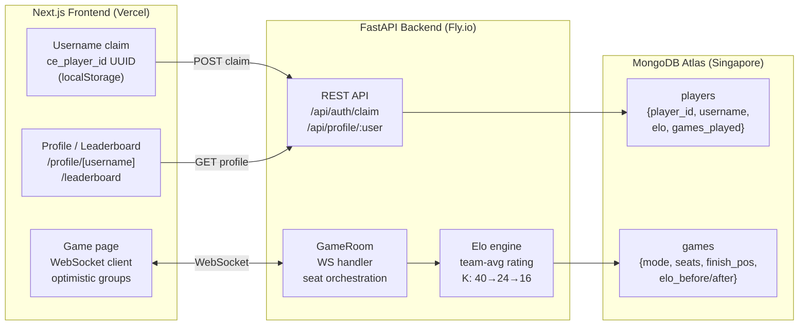

#### Methods

**Accounts:** First-claim-wins username model. UUID stored in `localStorage`; sent as `X-Player-ID` header. No passwords — UUID is the auth token. **Elo:** Team Elo uses `(player_elo + partner_elo) / 2` as the team rating; K-factor scales by experience (40 for first 30 games, 24 for 30–100, 16 after). Margin multiplier: 双上 (both win) ×1.5, normal ×1.0, narrow ×0.7. **Multiplayer rooms:** `GameManager` holds a dict of `game_id → GameRoom`; room codes are 6-char `secrets.choice` strings. `asyncio.Lock` prevents duplicate codes under concurrent creation. **AFK rope timer:** `asyncio.wait_for(timeout=HUMAN_TURN_TIMEOUT_S)` on the WS receive loop; on timeout, auto-plays PASS or smallest legal card. Frontend shows a burndown progress bar under the Play button. **Group UX:** Cards can be grouped into named combos before playing; optimistic local state merges pending temps with server-confirmed groups to avoid flicker on AI moves.

#### Results

| Feature | Detail |
|---------|--------|
| Multiplayer modes | Solo, Duo (2-player), Quad (4-player) |
| Accounts | UUID-based, first-claim username |
| Elo system | Team-averaged, K-factor by experience |
| Profile page | Elo history chart, recent games feed |
| Leaderboard | Human players + bot anchors |
| Playwright e2e | 25 tests pass, 1 skip (multiplayer + AFK + auth) |
| AFK timeout | 90s (env-configurable) |
| Disconnect recovery | 60s grace, then AI takeover |

#### Takeaway

In-memory `GameManager` is the right call for friends-only scale — Redis would add ops overhead for no benefit at <10 CCU. The optimistic group merge pattern (keep pending temps that the server hasn't confirmed yet, replace on match) is the right model for any optimistic UI over a slow feedback loop. Elo computation before the game-over broadcast (not in a background task) is essential — otherwise clients see Elo 0 in the modal.

---

### 16. Apr 1-2 — UI Polish + Production Deploy

#### Why

The app was functionally complete but rough around the edges. A focused polish pass (14 commits in one day) refined the UI — sidebar icons, backdrop blur, animated dropdowns, game-over Elo display, partner hand reveal. Then 15 pre-deploy hardening fixes addressed production failure modes before the first public deploy.

#### Architecture

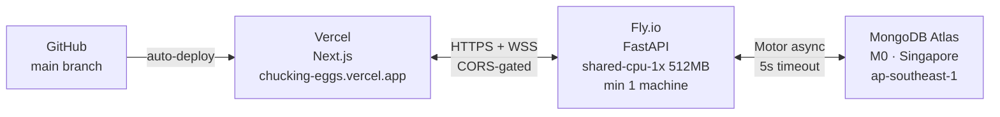

#### Methods

**UI polish highlights:** Lucide icons in sidebar, backdrop-blur modal overlay, Chinese subtitle (掼蛋) on home page, animated Play Solo dropdown (`max-h` CSS transition), partner hand revealed face-up when you finish first, game-over modal shows Elo before → after with color-coded delta.

**Hardening (15 fixes):**
- *Security:* `secrets.choice` for room codes (replace `random.choices`), `slowapi` rate limit on `/api/auth/claim` (5/minute), combo string truncation (64/32 chars)
- *Reliability:* `json.loads` try/except in WS loop, `.get("elo", 1200)` guard, post-game takeover guard (`not self.env.done`), `asyncio.Lock` on room creation, 5s DB query timeout
- *Frontend:* `JSON.parse` try/catch in WS `onmessage`, `gd_seat` cleared on `game_over`, `WebSocket.OPEN` guard on all sends, `createGame()` error UI, `localStorage` try/catch for Safari Private Mode, `STORAGE_KEYS` constants

**Deploy stack:** Fly.io backend (`shared-cpu-1x`, 512MB, `min_machines_running=1`, `auto_stop_machines=false` — required to preserve WebSocket connections). Vercel frontend (Next.js App Router, auto-deploy on push). MongoDB Atlas M0 (Singapore, matches Fly region `sin`).

#### Results

| Item | Detail |
|------|--------|
| Backend | https://chucking-eggs.fly.dev |
| Frontend | https://chucking-eggs-poohthewinnies-projects.vercel.app |
| Hardening fixes | 15 (security A1–A4, frontend A5–A8, scale C1–C6) |
| Tests at deploy | 25 pass, 1 skip — no regressions |
| Fly machine size | shared-cpu-1x · 512MB |
| DB | Atlas M0 · Singapore |

#### Takeaway

`fly launch` overwrites `fly.toml` with bad defaults (port 8080, `auto_stop_machines=true`). Always rewrite `fly.toml` after running it — the correct values are `internal_port=8000`, `auto_stop_machines=false`, `max_machines_running=1`. `uv add` writes to the root ML `pyproject.toml`, not `web/backend/requirements.txt` — never use it for backend dependencies. `slowapi` must be in `requirements.txt` and the Docker image rebuilt before Playwright tests can run against Docker backend.

### 17. Apr 3 — LLM Agent (GPT-5.4 Nano) via LiteLLM

#### Why

Curriculum RL training hit a compute wall: 25.8% comp avg after 54k episodes (6.4h on M1 Pro). DanZero-style agents need ~160 CPUs × 30 days — we have one M1 Pro. Instead of scaling compute, pivot to a fundamentally different approach: **LLM-based strategic agent** using GPT-5.4 Nano (~$0.01/game).

Prior art: HKUST paper (arXiv:2408.02559, Aug 2024) showed GPT-4-class LLMs nearly tied DanZero+ (-0.88 score gap) when given an RL action recommender to pre-filter 80+ legal moves to top-5. The RL pre-filter was essential — LLMs choke on large action spaces. We replace their trained RL recommender with JidanBot's explicit point-value scoring formula (cheap and no training required).

#### Architecture

3-stage pipeline per move:

```
legal_moves (27+ options)
    ↓
compute_cooperative_flags()   — GuanZero-style: can_cooperate / can_dwarf / can_assist
    ↓ (if any flag)
Stage 1: intent LLM call      — cooperate | dwarf | assist | normal
    ↓
filter_by_intent()            — RL Q-network scoring → top-K=8 candidates (falls back to JidanBot static)
    ↓ (if >1 candidate)
Stage 2.5: ToM beliefs LLM    — infer what opponents likely hold (conditional)
    ↓
Stage 3: move selection LLM   — picks from numbered list (with ToM context)
    ↓
Fallback: JidanBot best pick  — if parse fails
```

**Production-fair**: agent sees only own hand + card counts + public history (not opponent hand contents). Implemented in `llm_prompts.format_game_state()`.

**Theory of Mind (Stage 2.5)**: Before move selection, the LLM infers what each opponent/partner likely holds based on their played cards and action history. This belief text (~100 words) is injected into the stage 3 prompt. Conditional: only fires when `min_opp_remaining ≤ 15 OR len(move_history) ≥ 12` (skips early game). Controllable via `--tom-level 0|1|2` (off / 1st-order / 2nd-order).

#### Methods

- `src/guandan/agents/llm_prompts.py` — state serialization, cooperative flags (GuanZero-inspired), JidanBot scoring, intent filter, ToM belief formatting, parsers, system prompt
- `src/guandan/agents/llm_bot.py` — LLMBot agent with 3-stage + ToM pipeline, diagnostic stats
- `src/guandan/agents/rl_recommender.py` — lazy singleton wrapping `prod_03_29_11_51.pt` (Elo #1); scores top-K candidates via RL Q-network (~5 ms vs 500 ms LLM per call)
- `scripts/eval_llm.py` — eval runner with cost estimation, intent distribution, ToM stats
- Model: `gpt-5.4-nano` via LiteLLM (trivially swappable)
- Fallback: if LLM parse fails → RL Q-network best candidate (or JidanBot static if checkpoint missing)

#### Results

| Metric | Baseline (ToM=0) | ToM v1 | ToM v1 + RL recommender (50 games) |
|--------|-----------------|--------|--------------------------------------|
| Model | GPT-5.4 Nano | GPT-5.4 Nano | GPT-5.4 Nano |
| WR vs Jidan | 0% (10 games) | 0% (10 games) | **8%** |
| Fallback rate | 0% | 0% | 4.8% |
| ToM calls | — | 152 (27.7%) | 660 (28.4%) |
| Calls/game | 41.5 | 54.8 | ~46.5 |
| Est. cost/game | ~$0.007 | ~$0.010 | ~$0.008 |
| Intent distribution | coop 21% / assist 14% / dwarf 12% / normal 53% | coop 18% / assist 14% / dwarf 11% / normal 57% | coop 13% / assist 23% / dwarf 8% / normal 56% |

Context: random=0.5%, greedy=1%, heuristic=11.5%, strategic=24% vs Jidan over 200 games. **8% WR places LLMBot between greedy and heuristic.**

#### Why WR is low compared to the HKUST paper

The HKUST paper (arXiv:2408.02559) achieved GPT-4 + 2nd-order ToM nearly tying DanZero+ (-0.88 score gap). Our LLMBot gets 8% WR vs Jidan with RL recommender active. Two remaining structural differences explain the gap:

1. **Per-candidate evaluation vs single pick**. The paper evaluates each candidate individually (estimate expected team gain per move, then pick the best). We ask the LLM to pick from a numbered list in one shot. Their approach gives the model focused reasoning time per option; ours requires simultaneous comparison of 8 candidates in a single response.

2. **Chinese prompts**. The paper found Chinese prompts significantly outperformed English for Guan Dan strategy. We use English prompts exclusively.

Note: The paper's RL recommender used DanZero's trained embeddings (weights not public). We substituted our own Elo-#1 Q-network (`prod_03_29_11_51.pt`), which gives game-state-aware candidate ranking at ~5 ms overhead per move.

#### Takeaway

The RL recommender upgrade (static JidanBot scoring → Q-network) lifted WR from 0% to 8% on 10-game samples and to 8% over 50 games, placing LLMBot between greedy (1%) and heuristic (11.5%). The output format matters: asking for a number on the first line (before reasoning) eliminates parse failures. ToM adds ~30% cost for belief context; its WR impact is inconclusive at this sample size. The HKUST paper's key insight holds: LLMs need a strong action recommender — the Q-network delivers this without per-candidate LLM evaluation overhead.
