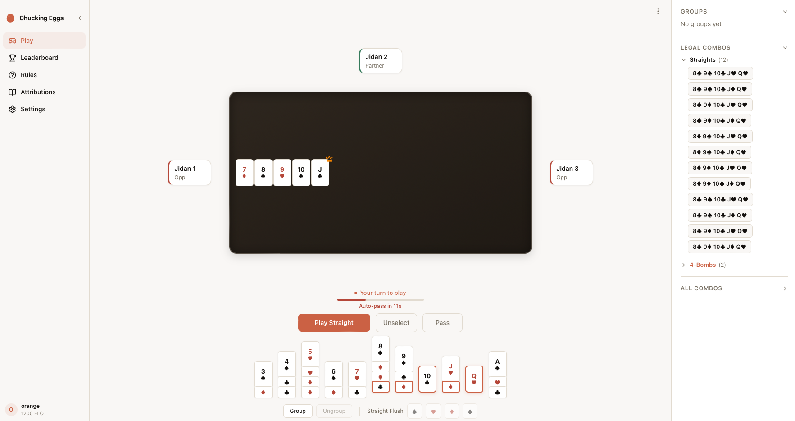
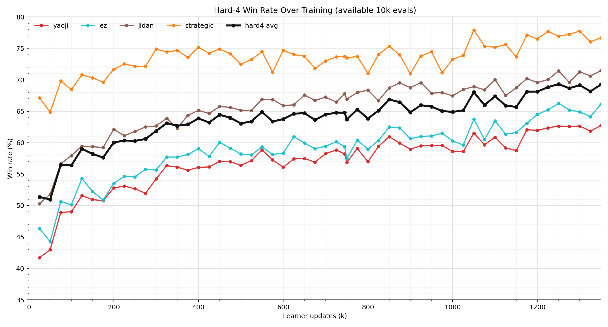
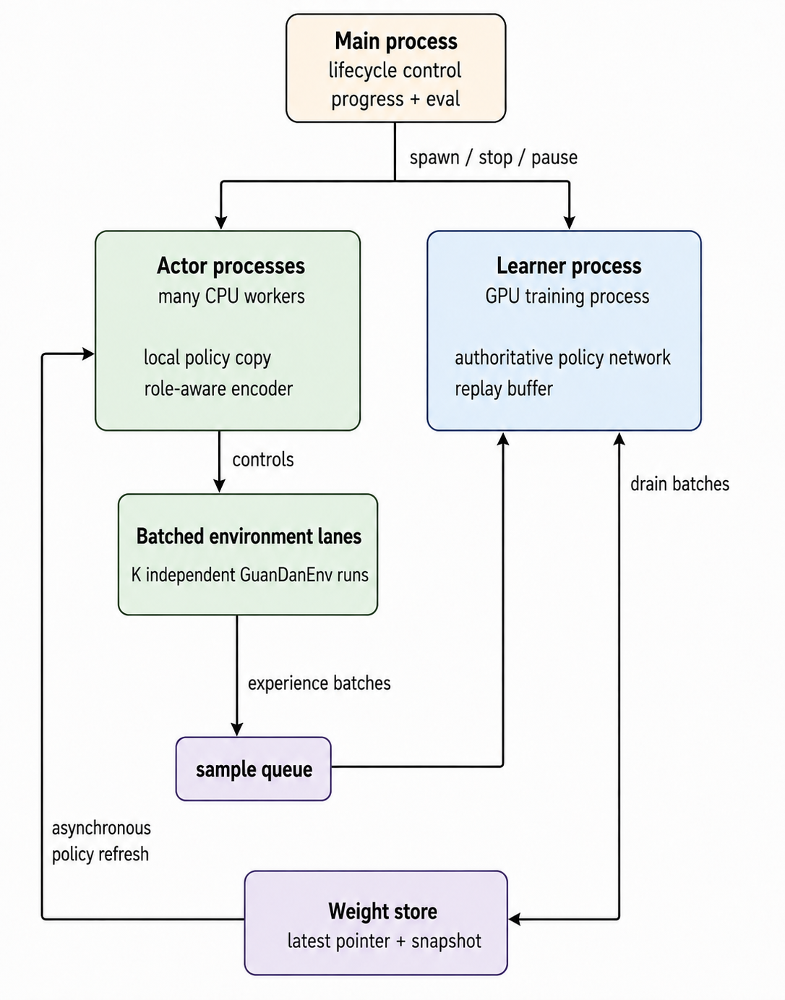
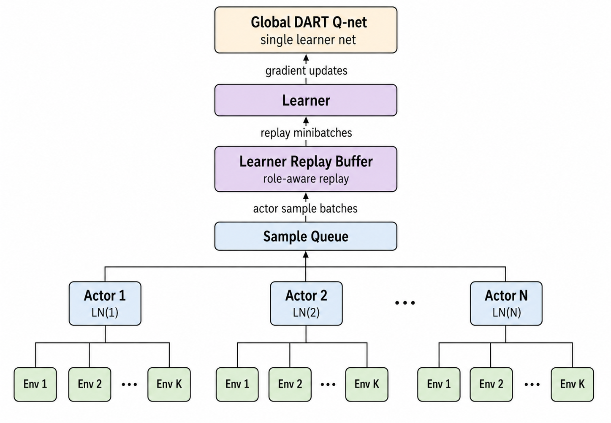
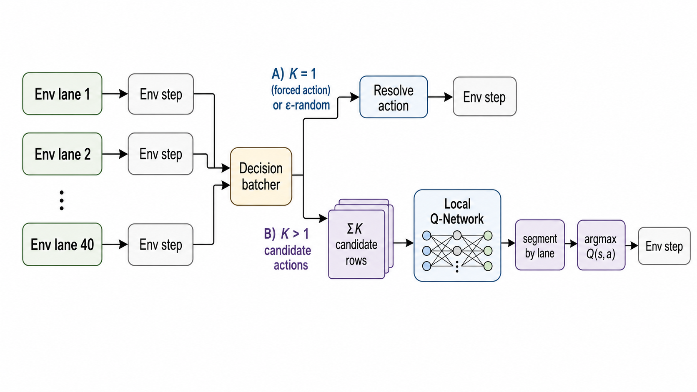
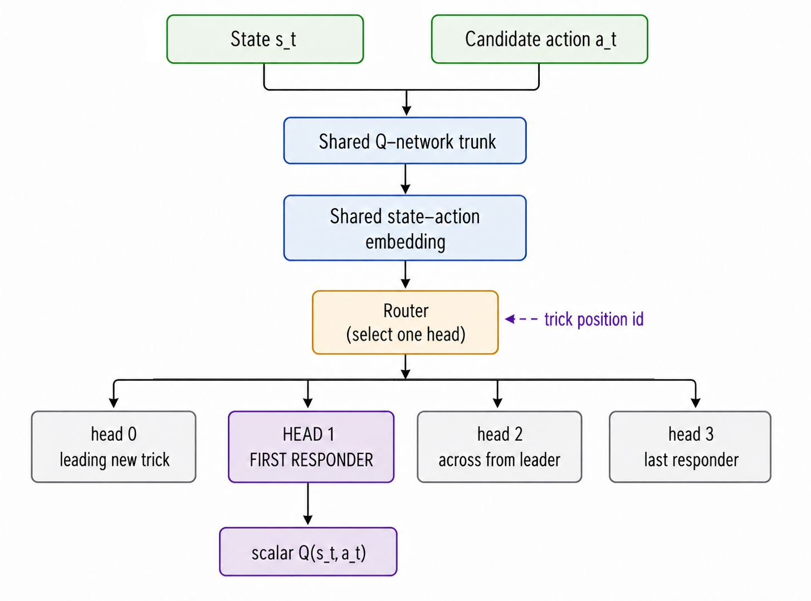

# DART — Partner-Visible Guan Dan RL Agent

[](https://github.com/winstonxcai/chucking-eggs/actions/workflows/ci.yml)

[](LICENSE)

**DART** (Dynamic Action-Relative Routing for Tricks) is a distributed partner-visible Deep Monte Carlo RL agent for **Guan Dan (掼蛋)**, a 4-player, 2v2 team trick-taking card game played with a 108-card double deck.

Guan Dan is harder than it looks: **108 cards** (vs 52 for most card games), **wild cards that change every round** (the "level card" shifts which rank is wild each hand, making suit relationships non-stationary), and **2v2 team play** where the optimal move often means sacrificing your own position to set up your partner. Standard single-agent RL does not handle this cleanly. DART trains a shared Q-network across 32 parallel actors with trick-position-relative heads, routing each decision by the actor's role in the current trick (leading, 1st responder, across, last) rather than absolute seat.

**Author**: Winston Cai · **License**: MIT

<p align="center">
  
</p>

## TL;DR

DART is, to our knowledge, the first open partner-visible Guan Dan RL agent with published training and evaluation code. The current checkpoint release is the **1.25M-update L4 run**. It reaches **69.32%** average win rate on the integrated 10,000-game hard-4 eval and **69.49%** on the 5000-game release eval against Yaoji, EZ, Jidan, and Strategic. In the 13-agent rule-bot benchmark, DART achieves the top Glicko-2 rating, outperforming all 12 bundled rule-based bots, including the top three from the [NJUPT 2020 Guan Dan AI Competition](http://gameai.njupt.edu.cn/gameaicompetition/) (Jidan, Yaoji, Lalala).

## Results

### Hard-4 Training Run



The hard-4 slice is the strongest public rule-bot evaluation set used during
long runs: Yaoji, EZ, Jidan, and Strategic. Integrated checkpoint evals use
10,000 paired fixed-deck games per opponent. On tuned Modal L4 resumes,
roughly 500k learner updates corresponds to one day of training, so the
trajectory x-axis is also a coarse wall-clock proxy after warmup.

| Checkpoint | Yaoji | EZ | Jidan | Strategic | Hard-4 Avg |
|------------|------:|---:|------:|----------:|-----------:|
| 1.25M updates | 62.65% | 66.25% | 71.43% | 76.95% | **69.32%** |
| 1.35M updates | 62.74% | 66.16% | 71.45% | 76.69% | 69.26% |

### Release Checkpoint Benchmark

The checkpoint release uses `update_01250000.pt` from the L4 run. The table
below is a fresh 5000-game paired fixed-deck eval against every bundled
rule-based bot. Standard errors are binomial standard errors over games.

| Opponent | Win Rate | Wins |
|----------|---------:|-----:|
| Random | 99.9% ± 0.1% | 4993/5000 |
| Greedy | 99.1% ± 0.1% | 4953/5000 |
| Heuristic | 93.0% ± 0.4% | 4649/5000 |
| Strategic | 77.6% ± 0.6% | 3878/5000 |
| XingDream | 95.6% ± 0.3% | 4779/5000 |
| Lalala | 93.0% ± 0.4% | 4650/5000 |
| Liuzha | 93.2% ± 0.4% | 4659/5000 |
| Hulalala | 93.0% ± 0.4% | 4650/5000 |
| Yaoji | 63.1% ± 0.7% | 3157/5000 |
| Jidan | 71.4% ± 0.6% | 3570/5000 |
| EZ | 65.9% ± 0.7% | 3293/5000 |
| WJSD | 88.8% ± 0.4% | 4439/5000 |

Glicko-2 ratings are derived from the existing 5000-game rule-bot round-robin
with the new 1.25M DART matchups injected; the rule-bot matrix was not rerun.

| Bot | Glicko-2 | Source |
|-----|----------|--------|
| **DART** | **1852** | This project |
| Jidan | 1744 | NJUPT 2020 2nd place (NUAA) |
| Yaoji | 1742 | NJUPT 2020 3rd place (NUAA) |
| EZ | 1667 | NJUPT 2020 3rd place (HYIT) |
| Strategic | 1597 | Hand-written heuristic |
| XingDream | 1485 | NJUPT 2020 |
| Heuristic | 1430 | Hand-written heuristic |
| Lalala | 1406 | NJUPT 2020 1st place (SEU) |
| Hulalala | 1403 | NJUPT 2020 3rd place (SEU) |
| Liuzha | 1401 | NJUPT 2020 2nd place (SEU) |
| Greedy | 1361 | Hand-written baseline (this project) |
| WJSD | 1327 | NJUPT 2020 3rd place (SAU) |
| Random | 1132 | |

## Method Summary

DART follows the DouZero-style Deep Monte Carlo pattern: actors generate complete games, the learner trains Q-values from terminal returns, and the model scores legal actions directly rather than learning a separate policy head. The learning objective is mean squared error, `MSE(Q(s_t, a_t), G_t)`, where `G_t` is the Monte Carlo return assigned after the game ends. The key architectural choice is action-relative routing: one shared network body feeds four Q-heads keyed by the player's role in the current trick (leading / 1st responder / across / last responder), which makes the model's output space align with how control actually changes during Guan Dan tricks. This is a lightweight MoE-inspired routing pattern at the output-head level: the router is deterministic, and the specialized modules are small Q-heads rather than full learned experts.

The state encoder is role-normalized and partner-visible. It includes the acting player's hand, the partner hand, public trick and round state, and move history through a shallow LSTM. This intentionally studies cooperative team play with direct partner-card access instead of forcing the model to spend most of its capacity inferring its teammate's private hand.

### Why Partner-Visible?

The intended DART setting is **partner-visible, not full perfect-information**.
Guan Dan is a partnership game: many strong moves are only strong because they
help the other seat on your team finish, preserve their control, or avoid
blocking their hand shape. The purpose of exposing the partner hand is to make
that coordination target unambiguous and learnable, instead of forcing the
model to spend most of its capacity inferring its own teammate's private cards.
In that sense, partner visibility is a research assumption for studying
cooperative play, not a claim that the policy is directly human-deployable under
strict hidden-information rules.

This is deliberately different from perfect-information play. The encoder
does include an `others_hand` channel, but it is the *union* of the two
opponent hands — the complement of `own_hand + partner_hand` in the 108-card
deck. A normal player already knows their own hand and therefore the
collective deck-complement; with partner visibility, that complement narrows
to exactly the cards held by the opposing team. `others_hand` is that
deck-subtraction precomputed as a feature, not per-opponent information. It
does not reveal which opponent holds which card. See
[`docs/TRADEOFFS.md`](docs/TRADEOFFS.md) §10 for the full discussion.

## Reproducibility Artifacts

- [Model card](docs/MODEL_CARD.md): checkpoint status, intended use, evaluation protocol, and release checklist.
- [Evaluation guide](docs/EVALUATION.md): commands for win-rate, matrix, and leaderboard runs.
- [Research overview](docs/RESEARCH.md): longer discussion of the DART formulation and benchmark setup.
- Release evidence: [`ml/results/release_1_25m`](ml/results/release_1_25m) contains the checkpoint, raw eval JSON, Glicko injection inputs, derived leaderboard, checksums, and manifest.

Evaluation commands:

```bash
# Win rate vs a specific opponent (paired fixed-deck)
uv run guandan-eval-dart \
    --checkpoint ml/results/release_1_25m/update_01250000.pt \
    --opponent strategic --games 5000 --out results.json

# Release-style all-bot eval
uv run guandan-eval-dart \
    --checkpoint ml/results/release_1_25m/update_01250000.pt \
    --opponent random greedy heuristic strategic xingdream lalala \
               liuzha hulalala yaoji jidan ez wjsd \
    --games 5000 --out ml/results/release_1_25m/eval_5k_all_bots.json
```

Exact bitwise training reproducibility is not guaranteed across CUDA/cuDNN kernels. Checkpoints restore learner RNG and actor RNG state for process-level resume consistency, but deterministic CUDA algorithms are not forced by default because they can reduce throughput or reject supported kernels.

## Quick Start

```bash
# Install (Python 3.10+, requires uv: https://docs.astral.sh/uv/getting-started/installation/)
git clone https://github.com/winstonxcai/chucking-eggs && cd chucking-eggs
uv sync --group dev

# Run tests
uv run pytest -q
```

Run the web app locally and play against the released 1.25M-update DART model:

```bash
# Terminal 1: backend API + WebSocket server
USE_MOCK_DB=true \
DART_WEB_ENABLED=true \
DART_CHECKPOINT=ml/results/release_1_25m/update_01250000.pt \
uv run uvicorn app.main:app --app-dir web/backend --host 127.0.0.1 --port 8000

# Terminal 2: frontend
cd web/frontend
nvm use
npm ci
NEXT_PUBLIC_API_URL=http://127.0.0.1:8000 npm run dev
```

The frontend uses Node 22; `web/frontend/.nvmrc` is checked in for `nvm use`.
Open `http://localhost:3000/game?difficulty=dart` to start a solo game directly
against DART, or open `http://localhost:3000`, choose **Play Solo**, then select
**DART**.

The legal-move engine works out of the box via a pure-Python `guandan_rs`
fallback. For faster local move generation, optionally build the native Rust
extension:

```bash
uv run maturin develop --release --manifest-path ml/src/guandan_rs/Cargo.toml
```

`maturin develop` installs `_guandan_rs`, which the Python `guandan_rs` package
uses automatically when present. If you re-run `uv sync`, re-run the maturin
step to restore native acceleration.

## Training

### Local CPU Smoke

Every contributor should be able to run the tiny CPU smoke. It checks the full
actor -> learner -> checkpoint path without requiring CUDA or Apple MPS.

```bash
uv run python -m guandan.dart \
    --config ml/src/guandan/dart/configs/dart_cpu_smoke.yaml \
    --updates 5 --run-dir ml/runs/cpu_smoke
```

CUDA configs fail fast on machines without CUDA. Use the CPU smoke for setup
checks, `dart_mps.yaml` for Apple Silicon, and the L4 configs only on GPU
hardware or Modal.

### Local MPS

DART is the production training path. We tested centralized GPU inference-server
variants, including cross-actor lane batching, and local batched actor inference
was faster for this model because it avoids IPC while still batching Q-forwards.

Runs 6 CPU actor processes + 1 MPS learner. Meaningful results (~50% vs strategic) in ~6h on an M1 Pro.

```bash
uv run python -m guandan.dart \
    --config ml/src/guandan/dart/configs/dart_mps.yaml \
    --updates 10000 --run-dir ml/runs/my_run
```

Outputs go to `ml/runs/my_run/` — `train.log`, `metrics_learner.jsonl`, `checkpoints/`.

### Modal GPU

L4 learner + 32 vCPU actors costs roughly $2.50/hr.

1. [Create a Modal account](https://modal.com) and install the CLI: `pip install modal && modal setup`
2. Create a volume for run outputs: `modal volume create dart-runs`
3. Launch:

```bash
# Dry-run — validates the config locally without launching training
modal run ml/scripts/modal/train_dart_modal.py --dry-run \
    --config-path /root/ml/src/guandan/dart/configs/dart_l4.yaml

# Example 50k shard (~8h from cold start; later resumed shards run faster)
modal run --detach ml/scripts/modal/train_dart_modal.py \
    --updates 50000 --run-name my_run \
    --config-path /root/ml/src/guandan/dart/configs/dart_l4.yaml
```

Download the checkpoint when done:

```bash
modal volume get dart-runs dart/my_run/checkpoints/update_00050000.pt .
```

Set `DART_MODAL_VOL=<volume-name>` or `DART_HF_CACHE=<volume-name>` before
`modal run` if you want to use existing Modal volumes instead of the defaults.

**Reference cost for the 1.25M-update release run:** logged learner metrics
cover the first 548k updates. The 0→200k actor-limited phase ran at ~1.6
upd/s (~34h); later tuned L4 resumes run at ~5-6 upd/s. Extrapolating that
post-200k rate to `update_01250000.pt`, the release checkpoint is roughly
85-90 L4 learner-hours, or ~$215-$225 at the reference $2.50/hr Modal rate,
excluding evaluation sweeps.

### Troubleshooting

- If `_guandan_rs` is missing, the pure-Python fallback keeps tests and local play working but is slower. Rebuild with `uv run maturin develop --release --manifest-path ml/src/guandan_rs/Cargo.toml`.
- If `uv sync` appears to remove the native extension, rerun the `maturin develop` command.
- For Modal log noise, use `DART_TQDM=0`; the launcher sets this automatically.

## Web App

Live app: [chucking-eggs.vercel.app](https://chucking-eggs.vercel.app) — solo, duo, and quad multiplayer with Elo ratings and leaderboard. Frontend is deployed on Vercel; backend is deployed on Fly.io. The hosted app intentionally does not serve DART for cost reasons; use the local quick start above to play against the released checkpoint.

Run it locally:

```bash
# Copy and fill in your MongoDB connection string
cp .env.example .env

# Start everything with Docker Compose
docker compose up
# Frontend: http://localhost:3000  Backend: http://localhost:8000
```

Or run services separately:

```bash
# Backend (FastAPI + game engine) — from repo root
uv pip install -e ".[web]"
uv run uvicorn app.main:app --reload --app-dir web/backend

# Frontend (Next.js) — in a separate terminal
cd web/frontend && npm install && npm run dev
```

## Architecture



This figure shows the runtime ownership boundaries. The main process handles
lifecycle and evaluation; actors own local policy copies and batched
environment lanes; the learner owns replay and the authoritative network; the
weight store provides asynchronous policy refresh.

**DART** (**D**ynamic **A**ction-**R**elative routing for **T**ricks) uses 4 shared Q-heads, one per trick position: leading / 1st responder / across / last responder. It combines an LSTM over move history, role-normalized state encoding, partner hand visibility during training, and distributed actor-learner execution. See [docs/ARCHITECTURE.md](docs/ARCHITECTURE.md) for the module map.



This figure isolates the distributed learning loop. Each actor owns one local
Q-network copy and controls multiple independent environment lanes. Actor
samples flow into learner-owned replay; learner updates train one global DART
Q-network, whose weights are periodically copied back to the actors.



This figure explains why actors run several lanes at once. Forced or
epsilon-random decisions bypass the network; nontrivial decisions are encoded
as legal candidate-action rows, scored by the local Q-network in a batched
forward pass, segmented back by lane, and resolved by per-lane argmax.

Recent Modal throughput probes show why DART uses intra-actor lane batching.
Numbers below are post-warmup means from 1000-update runs and report accepted
fresh actor samples/sec in `metrics_learner.jsonl`:

| GPU | GuanZero-style `32 x 1` | DART `32 x 128` | DART speedup |
|---|---:|---:|---:|
| L4 | 4,640 | 19,765 | **4.3x** |
| A10G | 4,889 | 22,383 | **4.6x** |

The `32 x 1` shape is actor-limited: the learner queue stays near empty. The
`32 x 128` shape is no longer actor-limited in these smokes: the learner queue
is mostly full and throughput is governed by learner speed and replay-ratio
throttling.



This figure shows the model's action-relative output layer. State and candidate
action features enter the shared Q-network trunk; the trick-position id is used
only by the deterministic router, which selects the Q-head for leading a new
trick, first responder, across from leader, or last responder.

## Documentation Index

- [Development setup](docs/DEVELOPMENT.md)
- [Configuration guide](docs/CONFIG.md)
- [Model card](docs/MODEL_CARD.md)
- [Research overview](docs/RESEARCH.md)
- [Terminology](docs/TERMINOLOGY.md)
- [Evaluation guide](docs/EVALUATION.md)
- [Architecture map](docs/ARCHITECTURE.md)
- [Tradeoffs and design decisions](docs/TRADEOFFS.md)
- [Debugging](docs/DEBUGGING.md)
- [Profiling](docs/PROFILING.md)
- [Backend API and WebSocket protocol](docs/API.md)
- [Release process](docs/RELEASE.md)
- [Contributing](docs/CONTRIBUTING.md)

## Examples and Extensibility

Runnable examples:

- `examples/dart_inference.py`
- `examples/eval_single_bot.py`
- `examples/play_rule_bot_hand.py`

### Adding Your Own Bot

Any `Agent` subclass with a single `act(env, player) -> Combo` method works:

```python
from guandan.agents.base import Agent
from guandan.game import GuanDanEnv
from guandan.combos import Combo

class MyBot(Agent):
    def act(self, env: GuanDanEnv, player: int) -> Combo:
        moves = env.legal_moves()
        return moves[0]  # replace with your logic
```

Register it in `ml/src/guandan/agents/__init__.py`:

```python
from .my_bot import MyBot
AGENT_REGISTRY["mybot"] = MyBot
```

Then use it anywhere:

```bash
uv run guandan-wr-matrix --agents mybot,strategic,jidan
```

Or add it to the training config under `opponents.hard_bot.bots` and give
`opponents.episode_mix.hard_bot` a nonzero weight to train against it.

## Related Work

This project builds on the DouZero / DanZero / GuanZero line of Deep Monte Carlo self-play agents for large-action Chinese card games. **DouZero** [1] showed that state-action Q-value scoring with Monte Carlo returns and parallel actors can work surprisingly well for DouDizhu; **DanZero** [2] and **GuanZero** [3] adapted this style of training to Guan Dan, with GuanZero adding behavior-aware encodings for cooperation, assisting, and dwarfing. DART diverges from GuanZero by using an explicit partner-visible state representation, role-normalized encodings, and trick-leader-relative shared heads rather than absolute-seat heads.

The broader lineage comes from **DQN** [4] (deep value-based RL) and **A3C** [5] (distributed asynchronous actor-learner). Card-game RL benchmarks and reference implementations are well-served by **RLCard** [6] and **OpenSpiel** [7], though neither includes Guan Dan as a first-class environment; the engine in this repo is a from-scratch implementation.

## Limitations

DART's hardest matchup remains Yaoji: the latest 1.35M checkpoint reaches
62.74% in the 10,000-game hard-4 eval, below the other hard opponents. The
reported model is **partner-visible** and should not be read as a strict
hidden-information policy: the partner hand is exposed in the state encoding.
The encoder also carries an `others_hand` channel that is the *union* of the
two opponent hands; this is a precomputed deck-complement (`full_deck −
own − partner`), not per-opponent oracle information — see
[`docs/TRADEOFFS.md`](docs/TRADEOFFS.md) §10. Training is **single-seed**:
there are no error bars across runs, only across eval games. Only the **L4 + M1
Pro** training paths are validated end-to-end. Evaluation is exclusively
head-to-head against rule-based bots; no human evaluation, and no comparison
against other learned agents because we are not aware of an openly released
partner-visible Guan Dan agent to benchmark against. Finally, the LSTM history
module is shallow, so there is likely room left at the ceiling.

## Citations

If you use this code or build on it, please cite the repo and the prior work it depends on:

```bibtex
@software{cai2026dart,
  author = {Cai, Winston},
  title = {DART: A Deep Monte Carlo RL Agent for Guan Dan},
  year = {2026},
  url = {https://github.com/winstonxcai/chucking-eggs}
}
```

References:

1. Zha, D. et al. *DouZero: Mastering DouDizhu with Self-Play Deep Reinforcement Learning.* ICML 2021. [arXiv:2106.06135](https://arxiv.org/abs/2106.06135)
2. Lu, Y. et al. *DanZero: Mastering GuanDan Game with Reinforcement Learning.* IEEE CoG 2022. [arXiv:2210.17087](https://arxiv.org/abs/2210.17087)
3. Zhao, Y. et al. *GuanZero: A behavior-aware Deep Monte Carlo agent for Guan Dan.*
4. Mnih, V. et al. *Human-level control through deep reinforcement learning.* Nature 2015. [arXiv:1312.5602](https://arxiv.org/abs/1312.5602)
5. Mnih, V. et al. *Asynchronous Methods for Deep Reinforcement Learning.* ICML 2016. [arXiv:1602.01783](https://arxiv.org/abs/1602.01783)
6. Zha, D. et al. *RLCard: A Toolkit for Reinforcement Learning in Card Games.* IJCAI 2020 (Demo). [arXiv:1910.04376](https://arxiv.org/abs/1910.04376)
7. Lanctot, M. et al. *OpenSpiel: A Framework for Reinforcement Learning in Games.* 2019. [arXiv:1908.09453](https://arxiv.org/abs/1908.09453)

## Acknowledgments

The rule-based bot pool is the backbone of evaluation. All eight competition bots — Jidan, Yaoji, Lalala, Liuzha, Hulalala, WJSD, EZ, and the basis for XingDream — originate from the [NJUPT 2020 Guan Dan AI Competition](http://gameai.njupt.edu.cn/gameaicompetition/), with student authors at NUAA, SEU, NJUPT, SAU, and HYIT. Credit and gratitude to those teams — the entire evaluation track of this project is downstream of their work.

- **Vendored bots** (Jidan, Yaoji, Lalala, Liuzha, Hulalala, WJSD, EZ) live under `ml/src/guandan/agents/_vendor/<bot>/` with the original team attribution preserved in each `__init__.py`. Changes were limited to import-path fixes and a thin adapter (`_vendor/adapter.py`) so each entry conforms to the `Agent.act(env, player) -> Combo` interface.
- **XingDream** (`xingdream_bot.py`) is a hand-written re-implementation of the strategy from the [xingdream/guandan](https://github.com/xingdream/guandan) repo, not a verbatim port.
- **License note for vendored code:** the original competition submissions did not ship with an explicit open-source license. We include them in good faith as research artifacts under the academic norm of attributed use. If you are an original author and would prefer your code be removed or relicensed, please open an issue.
- See [NOTICE](NOTICE) for the vendored-bot attribution and license-audit note.
