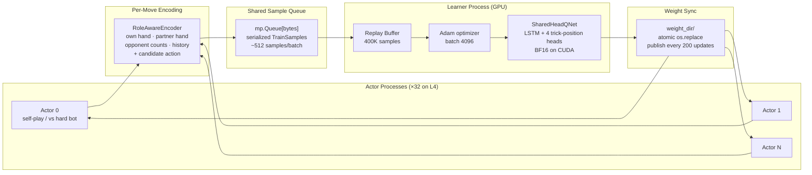

# DART — Guan Dan RL Agent

**DART** (Dynamic Action-Relative Routing for Tricks) is a distributed Deep Monte Carlo RL agent for **Guan Dan (掼蛋)**, a 4-player, 2v2 team trick-taking card game played with a 108-card double deck.

Guan Dan is harder than it looks: **108 cards** (vs 52 for most card games), **wild cards that change every round** (the "level card" shifts which rank is wild each hand, making suit relationships non-stationary), and **2v2 team play** where the optimal move often means sacrificing your own position to set up your partner. Standard single-agent RL doesn't handle this cleanly. DART trains a shared Q-network across 32 parallel actors with trick-position-relative heads — routing each decision by the actor's role in the current trick (leading, 1st responder, across, last) rather than absolute seat.

**Author**: Winston Cai

## Results

DART (DMC, 200k updates on L4 GPU) vs rule-based bots — 5000-game eval:

| Opponent | Win Rate | Notes |
|----------|----------|-------|
| Jidan (NJUPT 2020 2nd place) | **60.2% ± 0.7%** | Strongest rule-based bot |
| Yaoji (NJUPT 2020 3rd place) | **53.7% ± 0.7%** | |
| Strategic | 72.5% ± 0.6% | Best hand-written heuristic |
| XingDream | 93.3% ± 0.4% | |
| Heuristic | 89.9% ± 0.4% | |
| Greedy | 99.1% ± 0.1% | |
| Random | 99.7% ± 0.1% | |

Glicko-2 ratings from a full 5000-game round-robin across all 13 agents (DART included):

| Bot | Glicko-2 | Source |
|-----|----------|--------|
| **DART** | **1790** | This project |
| Jidan | 1750 | NJUPT 2020 2nd place (NUAA) |
| Yaoji | 1749 | NJUPT 2020 3rd place (NUAA) |
| EZ | 1675 | NJUPT 2020 3rd place (HYIT) |
| Strategic | 1601 | Hand-written heuristic |
| XingDream | 1488 | Open-source heuristic |
| Heuristic | 1434 | Hand-written heuristic |
| Lalala | 1409 | NJUPT 2020 1st place (SEU) |
| Hulalala | 1406 | NJUPT 2020 3rd place (SEU) |
| Liuzha | 1404 | NJUPT 2020 2nd place (SEU) |
| Greedy | 1364 | |
| WJSD | 1333 | NJUPT 2020 3rd place (SAU) |
| Random | 1135 | |

Web app live at [chucking-eggs.vercel.app](https://chucking-eggs.vercel.app) — solo, duo, and quad multiplayer with Elo ratings and leaderboard. (Frontend: Vercel · Backend: Fly.io)

## Quick Start

```bash
# Install (Python 3.10+, requires uv)
git clone https://github.com/PoohTheWinnie/chucking-eggs && cd chucking-eggs
uv sync

# Run tests
uv run pytest ml/tests/
```

### Training — Local (MPS)

Runs 6 CPU actor processes + 1 MPS learner. Meaningful results (~50% vs strategic) in ~6h on an M1 Pro.

```bash
uv run python -m guandan.dart \
    --config ml/src/guandan/dart/configs/m0_m1_distributed.yaml \
    --updates 10000 --run-name my_run
```

Outputs go to `ml/runs/my_run/` — `train.log`, `metrics_learner.jsonl`, `checkpoints/`.

### Training — Modal GPU (L4 learner + 32 vCPU actors, ~$2.50/hr)

1. [Create a Modal account](https://modal.com) and install the CLI: `pip install modal && modal setup`
2. Create a volume for run outputs: `modal volume create pvguan-runs`
3. Launch:

```bash
# Dry-run — validates config without billing
python ml/scripts/modal/train_dart_modal.py --dry-run \
    --config-path /root/ml/src/guandan/dart/configs/m5_clean_baseline_l4.yaml

# Full run (~50k updates, ~8h, ~$20 at ~1.8 upd/s steady-state)
modal run --detach ml/scripts/modal/train_dart_modal.py \
    --updates 50000 --run-name my_run \
    --config-path /root/ml/src/guandan/dart/configs/m5_clean_baseline_l4.yaml
```

Download the checkpoint when done:
```bash
modal volume get pvguan-runs dart/my_run/checkpoints/update_00050000.pt .
```

**Reference cost for full M5 baseline (0→200k updates):** ~30 hours, ~$75 across
multiple resumes. Steady-state throughput is ~1.8 upd/s on L4; the cold-start
phase (0→20k) is slower at ~1.4 upd/s.

### Evaluation

```bash
# Win rate vs a specific opponent (1000 games, paired fixed-deck)
uv run python ml/scripts/eval/eval_dart.py \
    --checkpoint ml/runs/my_run/checkpoints/update_00050000.pt \
    --opponent strategic --games 1000 --out results.json

# Full Glicko-2 leaderboard across all rule-based bots
uv run python ml/scripts/eval/wr_matrix.py --games 200
```

### Web App (local)

```bash
# Copy and fill in your MongoDB connection string
cp .env.example .env

# Start everything with Docker Compose
docker compose up
# Frontend: http://localhost:3000  Backend: http://localhost:8000
```

Or run services separately:

```bash
# Backend (FastAPI + game engine) — from repo root
uv pip install -e ".[web]"
uv run uvicorn app.main:app --reload --app-dir web/backend

# Frontend (Next.js) — in a separate terminal
cd web/frontend && npm install && npm run dev
```

## Adding Your Own Bot

Any `Agent` subclass with a single `act(env, player) -> Combo` method works:

```python
from guandan.agents.base import Agent
from guandan.game import GuanDanEnv
from guandan.combos import Combo

class MyBot(Agent):
    def act(self, env: GuanDanEnv, player: int) -> Combo:
        moves = env.legal_moves()
        return moves[0]  # replace with your logic
```

Register it in `ml/src/guandan/agents/__init__.py`:

```python
from .my_bot import MyBot
AGENT_REGISTRY["mybot"] = MyBot
```

Then use it anywhere:

```bash
uv run python ml/scripts/eval/wr_matrix.py --agents mybot,strategic,jidan
```

Or pass it directly to the training config (`hard_bot_pool: [mybot]`) to train against it.

## DART Architecture



**DART** (**D**ynamic **A**ction-**R**elative routing for **T**ricks) — 4 shared Q-heads (one per trick position: leading / 1st-resp / across / last-resp). LSTM over move history, role-normalized state encoding, partner hand visible during training.

