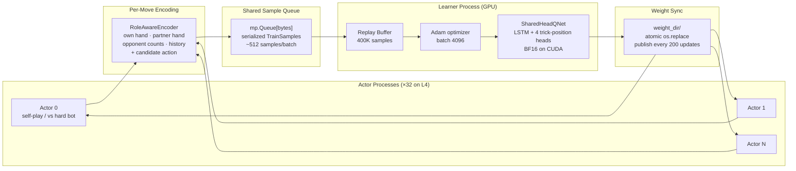

# DART — Partner-Visible Guan Dan RL Agent

**DART** (Dynamic Action-Relative Routing for Tricks) is a distributed partner-visible Deep Monte Carlo RL agent for **Guan Dan (掼蛋)**, a 4-player, 2v2 team trick-taking card game played with a 108-card double deck.

Guan Dan is harder than it looks: **108 cards** (vs 52 for most card games), **wild cards that change every round** (the "level card" shifts which rank is wild each hand, making suit relationships non-stationary), and **2v2 team play** where the optimal move often means sacrificing your own position to set up your partner. Standard single-agent RL doesn't handle this cleanly. DART trains a shared Q-network across 32 parallel actors with trick-position-relative heads — routing each decision by the actor's role in the current trick (leading, 1st responder, across, last) rather than absolute seat.

**Author**: Winston Cai · **License**: MIT

**TL;DR:** Trained from scratch on a single L4 GPU in ~30 hours for ~$75 of cloud compute, DART is, to our knowledge, the first open partner-visible Guan Dan RL agent with published training and evaluation code. In this repo's 13-agent rule-bot benchmark, it achieves the top Glicko-2 rating — outperforming all 12 published rule-based bots, including the top three from the [NJUPT 2020 Guan Dan AI Competition](http://gameai.njupt.edu.cn/gameaicompetition/) (Jidan, Yaoji, Lalala).

## Results

DART (DMC, 200k updates on L4 GPU) vs rule-based bots — 5000-game eval:

| Opponent | Win Rate | Notes |
|----------|----------|-------|
| Jidan (NJUPT 2020 2nd place) | **60.2% ± 0.7%** | Strongest rule-based bot |
| Yaoji (NJUPT 2020 3rd place) | **53.7% ± 0.7%** | |
| Strategic | 72.5% ± 0.6% | Best hand-written heuristic |
| XingDream | 93.3% ± 0.4% | |
| Heuristic | 89.9% ± 0.4% | |
| Greedy | 99.1% ± 0.1% | |
| Random | 99.7% ± 0.1% | |

Glicko-2 ratings from a full 5000-game round-robin across all 13 agents (DART included):

| Bot | Glicko-2 | Source |
|-----|----------|--------|
| **DART** | **1790** | This project |
| Jidan | 1750 | NJUPT 2020 2nd place (NUAA) |
| Yaoji | 1749 | NJUPT 2020 3rd place (NUAA) |
| EZ | 1675 | NJUPT 2020 3rd place (HYIT) |
| Strategic | 1601 | Hand-written heuristic |
| XingDream | 1488 | NJUPT 2020 |
| Heuristic | 1434 | Hand-written heuristic |
| Lalala | 1409 | NJUPT 2020 1st place (SEU) |
| Hulalala | 1406 | NJUPT 2020 3rd place (SEU) |
| Liuzha | 1404 | NJUPT 2020 2nd place (SEU) |
| Greedy | 1364 | |
| WJSD | 1333 | NJUPT 2020 3rd place (SAU) |
| Random | 1135 | |

Web app live at [chucking-eggs.vercel.app](https://chucking-eggs.vercel.app) — solo, duo, and quad multiplayer with Elo ratings and leaderboard. (Frontend: Vercel · Backend: Fly.io)

## Quick Start

```bash
# Install (Python 3.10+, requires uv)
git clone https://github.com/PoohTheWinnie/chucking-eggs && cd chucking-eggs
uv sync --group dev

# Run tests
uv run pytest -q
```

The legal-move engine works out of the box via a pure-Python `guandan_rs`
fallback. For faster local move generation, optionally build the native Rust
extension:

```bash
uv run maturin develop --release --manifest-path ml/src/guandan_rs/Cargo.toml
```

`maturin develop` installs `_guandan_rs`, which the Python `guandan_rs` package
uses automatically when present. If you re-run `uv sync`, re-run the maturin
step to restore native acceleration.

### Training — Local (MPS)

DART is the production training path. We tested centralized GPU inference-server
variants, including cross-actor lane batching, and local batched actor inference
was faster for this model because it avoids IPC while still batching Q-forwards.

Runs 6 CPU actor processes + 1 MPS learner. Meaningful results (~50% vs strategic) in ~6h on an M1 Pro.

```bash
uv run python -m guandan.dart \
    --config ml/src/guandan/dart/configs/dart_mps.yaml \
    --updates 10000 --run-dir ml/runs/my_run
```

Outputs go to `ml/runs/my_run/` — `train.log`, `metrics_learner.jsonl`, `checkpoints/`.

### Training — Modal GPU (L4 learner + 32 vCPU actors, ~$2.50/hr)

1. [Create a Modal account](https://modal.com) and install the CLI: `pip install modal && modal setup`
2. Create a volume for run outputs: `modal volume create pvguan-runs`
3. Launch:

```bash
# Dry-run — validates the config locally without launching training
modal run ml/scripts/modal/train_dart_modal.py --dry-run \
    --config-path /root/ml/src/guandan/dart/configs/dart_l4.yaml

# Full run (~50k updates, ~8h, ~$20 at ~1.8 upd/s steady-state)
modal run --detach ml/scripts/modal/train_dart_modal.py \
    --updates 50000 --run-name my_run \
    --config-path /root/ml/src/guandan/dart/configs/dart_l4.yaml
```

Download the checkpoint when done:
```bash
modal volume get pvguan-runs dart/my_run/checkpoints/update_00050000.pt .
```

**Reference cost for a full run (0→200k updates):** ~30 hours, ~$75 across
multiple resumes. Steady-state throughput is ~1.8 upd/s on L4; the cold-start
phase (0→20k) is slower at ~1.4 upd/s.

### Evaluation

```bash
# Win rate vs a specific opponent (1000 games, paired fixed-deck)
uv run ml/scripts/eval/eval_dart.py \
    --checkpoint ml/runs/my_run/checkpoints/update_00050000.pt \
    --opponent strategic --games 1000 --out results.json

# Full Glicko-2 leaderboard across all rule-based bots
uv run ml/scripts/eval/wr_matrix.py --games 200
```

### Web App (local)

```bash
# Copy and fill in your MongoDB connection string
cp .env.example .env

# Start everything with Docker Compose
docker compose up
# Frontend: http://localhost:3000  Backend: http://localhost:8000
```

Or run services separately:

```bash
# Backend (FastAPI + game engine) — from repo root
uv pip install -e ".[web]"
uv run uvicorn app.main:app --reload --app-dir web/backend

# Frontend (Next.js) — in a separate terminal
cd web/frontend && npm install && npm run dev
```

## Adding Your Own Bot

Any `Agent` subclass with a single `act(env, player) -> Combo` method works:

```python
from guandan.agents.base import Agent
from guandan.game import GuanDanEnv
from guandan.combos import Combo

class MyBot(Agent):
    def act(self, env: GuanDanEnv, player: int) -> Combo:
        moves = env.legal_moves()
        return moves[0]  # replace with your logic
```

Register it in `ml/src/guandan/agents/__init__.py`:

```python
from .my_bot import MyBot
AGENT_REGISTRY["mybot"] = MyBot
```

Then use it anywhere:

```bash
uv run ml/scripts/eval/wr_matrix.py --agents mybot,strategic,jidan
```

Or add it to the training config under `opponents.hard_bot.bots` and give
`opponents.episode_mix.hard_bot` a nonzero weight to train against it.

## DART Architecture



**DART** (**D**ynamic **A**ction-**R**elative routing for **T**ricks) — 4 shared Q-heads (one per trick position: leading / 1st-resp / across / last-resp). LSTM over move history, role-normalized state encoding, partner hand visible during training.

## Related Work

This project builds on the DouZero / DanZero / GuanZero line of Deep Monte Carlo self-play agents for large-action Chinese card games. **DouZero** [1] showed that state-action Q-value scoring with Monte Carlo returns and parallel actors can work surprisingly well for DouDizhu; **DanZero** [2] and **GuanZero** [3] adapted this style of training to Guan Dan, with GuanZero adding behavior-aware encodings for cooperation, assisting, and dwarfing. DART diverges from GuanZero by using an explicit partner-visible state representation, role-normalized encodings, and trick-leader-relative shared heads rather than absolute-seat heads.

The broader lineage comes from **DQN** [4] (deep value-based RL) and **A3C** [5] (distributed asynchronous actor-learner). Card-game RL benchmarks and reference implementations are well-served by **RLCard** [6] and **OpenSpiel** [7], though neither includes Guan Dan as a first-class environment — the engine in this repo is a from-scratch implementation.

## Limitations

DART's hardest matchup remains Yaoji: the win rate sits in the 49–53% band even at 200k updates and has never decisively crossed 55%, which we attribute to Yaoji's `Score = Gain*(1+Possibility)/Value` scoring function with explicit partner-position weighting being structurally different from the patterns self-play converges on. The reported model is **partner-visible** and should not be read as a strict hidden-information policy: the partner hand is exposed, and the current role-aware checkpoint also carries an `others_hand` opponent-hand channel. Treat the numbers as partner-visible/oracle-style benchmarking, not as human-deployable partial-observation performance. Training is **single-seed**: there are no error bars across runs, only across eval games (CI widths in the results table). Only the **L4 + M1 Pro** training paths are validated end-to-end. Evaluation is exclusively head-to-head against rule-based bots — no human evaluation, and no comparison against other learned agents because we are not aware of an openly released partner-visible Guan Dan agent to benchmark against. Finally, the LSTM history module is shallow (one layer) and the run is short by DMC standards (200k updates vs DouZero's >1M) — there is likely room left at the ceiling.

## Citations

If you use this code or build on it, please cite the repo and the prior work it depends on:

```bibtex
@software{cai2026dart,
  author = {Cai, Winston},
  title = {DART: A Deep Monte Carlo RL Agent for Guan Dan},
  year = {2026},
  url = {https://github.com/PoohTheWinnie/chucking-eggs}
}
```

References:

1. Zha, D. et al. *DouZero: Mastering DouDizhu with Self-Play Deep Reinforcement Learning.* ICML 2021. [arXiv:2106.06135](https://arxiv.org/abs/2106.06135)
2. Lu, Y. et al. *DanZero: Mastering GuanDan Game with Reinforcement Learning.* IEEE CoG 2022. [arXiv:2210.17087](https://arxiv.org/abs/2210.17087)
3. Zhao, Y. et al. *GuanZero: A behavior-aware Deep Monte Carlo agent for Guan Dan.*
4. Mnih, V. et al. *Human-level control through deep reinforcement learning.* Nature 2015. [arXiv:1312.5602](https://arxiv.org/abs/1312.5602)
5. Mnih, V. et al. *Asynchronous Methods for Deep Reinforcement Learning.* ICML 2016. [arXiv:1602.01783](https://arxiv.org/abs/1602.01783)
6. Zha, D. et al. *RLCard: A Toolkit for Reinforcement Learning in Card Games.* IJCAI 2020 (Demo). [arXiv:1910.04376](https://arxiv.org/abs/1910.04376)
7. Lanctot, M. et al. *OpenSpiel: A Framework for Reinforcement Learning in Games.* 2019. [arXiv:1908.09453](https://arxiv.org/abs/1908.09453)

## Acknowledgments

The rule-based bot pool is the backbone of evaluation. All eight competition bots — Jidan, Yaoji, Lalala, Liuzha, Hulalala, WJSD, EZ, and the basis for XingDream — originate from the [NJUPT 2020 Guan Dan AI Competition](http://gameai.njupt.edu.cn/gameaicompetition/), with student authors at NUAA, SEU, NJUPT, SAU, and HYIT. Credit and gratitude to those teams — the entire evaluation track of this project is downstream of their work.

- **Vendored bots** (Jidan, Yaoji, Lalala, Liuzha, Hulalala, WJSD, EZ) live under `ml/src/guandan/agents/_vendor/<bot>/` with the original team attribution preserved in each `__init__.py`. Changes were limited to import-path fixes and a thin adapter (`_vendor/adapter.py`) so each entry conforms to the `Agent.act(env, player) -> Combo` interface.
- **XingDream** (`xingdream_bot.py`) is a hand-written re-implementation of the strategy from the [xingdream/guandan](https://github.com/xingdream/guandan) repo, not a verbatim port.
- **License note for vendored code:** the original competition submissions did not ship with an explicit open-source license. We include them in good faith as research artifacts under the academic norm of attributed use. If you are an original author and would prefer your code be removed or relicensed, please open an issue.
