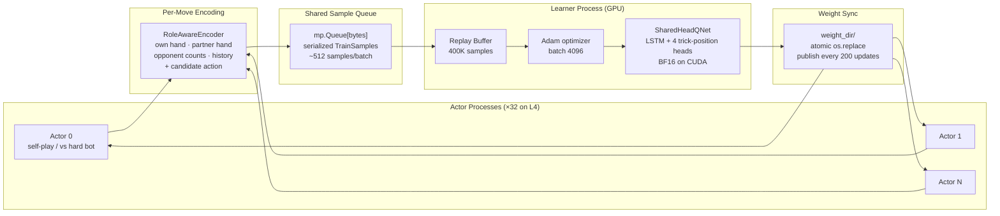

# Guan Dan RL Agent — Development Log

**Guan Dan (掼蛋)** is a 4-player, 2v2 team trick-taking card game played with a 108-card double deck. Unlike Go or Chess, the state space explodes in three compounding directions: **108-card double deck** (vs 52 for most card games), **wild cards that shift each round** (the "level card" changes every hand, so suit relationships are non-stationary), and **2v2 team play** where the optimal move for your seat often depends on sacrificing your own position to set up your partner. Standard single-agent RL doesn't handle this cleanly. This project builds a competitive RL agent from scratch — full game engine, distributed Deep Monte Carlo training (32 actors + 1 GPU learner), and a playable web app with calibrated difficulty tiers.

**Author**: Winston Cai

## Results

GuanZero (DMC, 135k updates on L4 GPU) vs rule-based bots — 1000-game paired fixed-deck eval:

| Opponent | Win Rate | Notes |
|----------|----------|-------|
| Jidan (NJUPT 2020 2nd place) | **59.4% ± 1.6%** | Strongest rule-based bot |
| Yaoji (NJUPT 2020 3rd place) | **48.4% ± 1.6%** | Near coin-flip |
| Strategic | 68.6% ± 1.5% | Best hand-written heuristic |
| XingDream | 92.1% ± 0.9% | |
| Heuristic | 88.3% ± 1.0% | |
| Greedy | 98.9% ± 0.3% | |
| Random | 99.6% ± 0.2% | |

Glicko-2 ratings from 5000-game round-robin across all 12 rule-based bots (GuanZero not in this run — partial matchup data puts it above Jidan):

| Bot | Glicko-2 | Source |
|-----|----------|--------|
| **GuanZero** | **#1** | This project |
| Jidan | 1891 | NJUPT 2020 2nd place (NUAA) |
| Yaoji | 1870 | NJUPT 2020 3rd place (NUAA) |
| Strategic | 1729 | Hand-written heuristic |
| XingDream | 1622 | Open-source heuristic |
| Lalala | 1557 | NJUPT 2020 1st place (SEU) |
| Heuristic | 1557 | Hand-written heuristic |
| Greedy | 1523 | |
| Liuzha | 1320 | NJUPT 2020 2nd place (SEU) |
| Hulalala | 1320 | NJUPT 2020 3rd place (SEU) |
| Random | 1316 | |
| WJSD | 1250 | NJUPT 2020 3rd place (SAU) |
| EZ | 1031 | NJUPT 2020 3rd place (HYIT) |

Web app live at [chucking-eggs.fly.dev](https://chucking-eggs.fly.dev) — solo, duo, and quad multiplayer with Elo ratings and leaderboard.

## Quick Start

```bash
# Install (Python 3.10+, requires uv)
git clone https://github.com/PoohTheWinnie/chucking-eggs && cd chucking-eggs
uv sync

# Run tests
uv run pytest ml/tests/
```

### Training — Local (CPU)

Runs 6 actor processes + 1 learner on CPU. Meaningful results (~50% vs strategic) in ~6h on an M1 Pro.

```bash
PYTHONPATH=ml/src python -m guandan.guanzero \
    --config ml/src/guandan/guanzero/configs/m0_m1_distributed.yaml \
    --updates 10000 --run-name my_run
```

Outputs go to `ml/runs/my_run/` — `train.log`, `metrics_learner.jsonl`, `checkpoints/`.

### Training — Modal GPU (L4, ~$2.89/hr)

1. [Create a Modal account](https://modal.com) and install the CLI: `pip install modal && modal setup`
2. Create a volume for run outputs: `modal volume create pvguan-runs`
3. Launch:

```bash
# Dry-run — validates config without billing
python ml/scripts/modal/train_guanzero_modal.py --dry-run \
    --config-path /root/ml/src/guandan/guanzero/configs/m5_clean_baseline_l4.yaml

# Full run (~50k updates, ~2h, ~$6)
modal run --detach ml/scripts/modal/train_guanzero_modal.py \
    --updates 50000 --run-name my_run \
    --config-path /root/ml/src/guandan/guanzero/configs/m5_clean_baseline_l4.yaml
```

Download the checkpoint when done:
```bash
modal volume get pvguan-runs guanzero/my_run/checkpoints/update_00050000.pt .
```

### Evaluation

```bash
# Win rate vs a specific opponent (1000 games, paired fixed-deck)
PYTHONPATH=ml/src python ml/scripts/eval/eval_guanzero.py \
    --checkpoint ml/runs/my_run/checkpoints/update_00050000.pt \
    --opponent strategic --games 1000 --out results.json

# Full Glicko-2 leaderboard across all rule-based bots
PYTHONPATH=ml/src python ml/scripts/eval/wr_matrix.py --games 200
```

### Web App (local)

```bash
# Backend (FastAPI + game engine)
cd web/backend && pip install -r requirements.txt
PYTHONPATH=../../ml/src uvicorn app.main:app --reload
# Backend runs at http://localhost:8000

# Frontend (Next.js) — in a separate terminal
cd web/frontend && npm install && npm run dev
# Open http://localhost:3000
```

## Adding Your Own Bot

Any `Agent` subclass with a single `act(env, player) -> Combo` method works:

```python
from guandan.agents.base import Agent
from guandan.game import GuanDanEnv
from guandan.combos import Combo

class MyBot(Agent):
    def act(self, env: GuanDanEnv, player: int) -> Combo:
        moves = env.legal_moves()
        return moves[0]  # replace with your logic
```

Register it in `ml/src/guandan/agents/__init__.py`:

```python
from .my_bot import MyBot
AGENT_REGISTRY["mybot"] = MyBot
```

Then use it anywhere:

```bash
PYTHONPATH=ml/src python ml/scripts/eval/wr_matrix.py --agents mybot,strategic,jidan
```

Or pass it directly to the training config (`hard_bot_pool: [mybot]`) to train against it.

## GuanZero Architecture



**Model:** 4 shared Q-heads (one per trick position: leading / 1st-resp / across / last-resp). LSTM over move history, role-normalized state encoding, partner hand visible during training.

